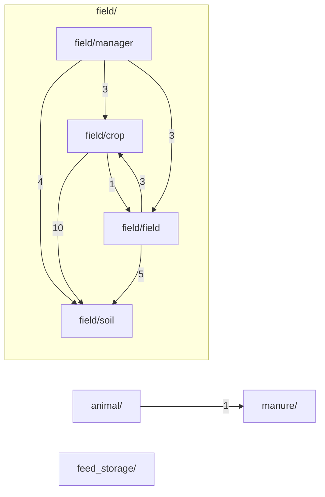
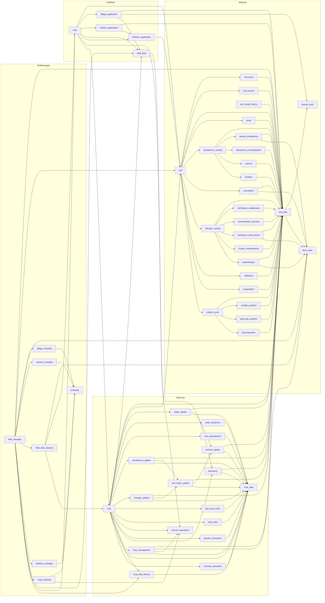
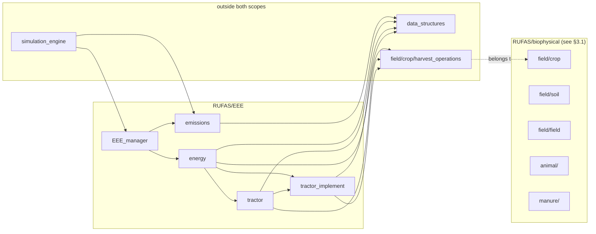

# RUFAS biophysical core — architecture & dependency map

**Repository:** `C:\Proyectos\RuFaS-MyForageSystem`  
**Branch / commit:** `research/andrea-msf-prototype` @ `8dabc49`  
**Scope:** `RUFAS/biophysical/**` — 173 Python modules  
**Method:** static AST parsing only. No RUFAS code was imported or executed.  
**Generated:** 2026-08-19

> **Ground rule applied throughout:** purposes are taken verbatim from module or class
> docstrings. Where none exists the entry reads **no docstring** and describes only what
> the code structurally defines. Nothing is inferred from module names.

**Docstring coverage:** 3 of 173 modules carry a module-level docstring. The remaining 170
document themselves at class level, so most rows below quote a class docstring instead.

---

## 1. Scope and size

| Package | Modules | Lines |
| --- | ---: | ---: |
| `RUFAS/biophysical/animal` | 73 | 27,263 |
| `RUFAS/biophysical/field/soil` | 30 | 10,125 |
| `RUFAS/biophysical/manure` | 27 | 6,099 |
| `RUFAS/biophysical/field/crop` | 18 | 5,140 |
| `RUFAS/biophysical/field/manager` | 8 | 4,023 |
| `RUFAS/biophysical/field/field` | 6 | 3,271 |
| `RUFAS/biophysical/feed_storage` | 9 | 2,746 |
| `RUFAS/biophysical/__init__` | 1 | 0 |
| `RUFAS/biophysical/field` | 1 | 0 |
| **Total** | **173** | **58,667** |

---

## 2. Modules in scope

Line counts are total physical lines. Modules over 500 lines are marked **(large)** and are
described by entry points only, per the analysis constraints.

### `RUFAS/biophysical/__init__` — 1 modules, 0 lines

| File path | LOC | Purpose |
| --- | ---: | --- |
| `RUFAS/biophysical/__init__.py` | 0 | no docstring — empty module (0 top-level definitions) |

### `RUFAS/biophysical/animal` — 73 modules, 27,263 lines

| File path | LOC | Purpose |
| --- | ---: | --- |
| `RUFAS/biophysical/animal/__init__.py` | 0 | no docstring — empty module (0 top-level definitions) |
| `RUFAS/biophysical/animal/animal.py` | 3265 **(large)** | no module docstring — `Animal` class docstring: This class represents an animal in the RuFaS simulation. Parameters ---------- args : NewBornCalfValuesTypedDict | CalfValuesTypedDict | HeiferIValues… |
| `RUFAS/biophysical/animal/animal_config.py` | 739 **(large)** | no module docstring — `AnimalConfig` class docstring: AnimalConfig class that holds all the animal configuration parameters from user input. Attributes ---------- wean_day : int The number of days after b… |
| `RUFAS/biophysical/animal/animal_constants.py` | 177 | no docstring — empty module (0 top-level definitions) |
| `RUFAS/biophysical/animal/animal_genetics/__init__.py` | 0 | no docstring — empty module (0 top-level definitions) |
| `RUFAS/biophysical/animal/animal_genetics/animal_genetics.py` | 442 | no module docstring — `Genetics` class docstring: Genetic attributes of an animal. Attributes ---------- TBV_fat : float True Breeding Value for fat, (kg). TBV_protein : float True Breeding Value for … |
| `RUFAS/biophysical/animal/animal_grouping_scenarios.py` | 223 | no module docstring — `AnimalGroupingScenario` class docstring: The different scenarios for grouping animals on a farm. Each scenario is a dictionary of the form: { AnimalCombination: [list of animal types/subtypes… |
| `RUFAS/biophysical/animal/animal_health/__init__.py` | 0 | no docstring — empty module (0 top-level definitions) |
| `RUFAS/biophysical/animal/animal_health/animal_health.py` | 32 | no docstring — defines `AnimalHealth` |
| `RUFAS/biophysical/animal/animal_health/animal_health_status.py` | 24 | no module docstring — `AnimalHealthStatus` class docstring: Calculator class representing the health status of the animal. Will be the avenue for communicating data between the Animal object and the animal's he… |
| `RUFAS/biophysical/animal/animal_health/disease.py` | 74 | no module docstring — `Disease` class docstring: Class representing disease simulation. |
| `RUFAS/biophysical/animal/animal_health/outcomes.py` | 34 | no module docstring — `DiseaseOutcomes` class docstring: A list of possible outcomes for animals that have developed a disease. HEALTHY : str Animal is healthy. DEAD : str Animal dies while sick. IN_RECOVERY… |
| `RUFAS/biophysical/animal/animal_module_constants.py` | 615 **(large)** | no module docstring — `AnimalModuleConstants` class docstring: A class used to store constants related to the animal module. |
| `RUFAS/biophysical/animal/animal_module_reporter.py` | 1532 **(large)** | no module docstring — `AnimalModuleReporter` class docstring: The reporting class for the Animal module. |
| `RUFAS/biophysical/animal/bedding/__init__.py` | 0 | no docstring — empty module (0 top-level definitions) |
| `RUFAS/biophysical/animal/bedding/bedding.py` | 180 | no module docstring — `Bedding` class docstring: Abstract base class for all bedding types. Parameters ---------- name : str Unique identifier to reference this bedding configuration. bedding_mass_pe… |
| `RUFAS/biophysical/animal/data_types/animal_combination.py` | 43 | no module docstring — `AnimalCombination` class docstring: Enumeration that represents the valid combinations of animals in a pen. Attributes ---------- CALF : str Represents a calf-only pen. GROWING : str Rep… |
| `RUFAS/biophysical/animal/data_types/animal_enums.py` | 43 | no module docstring — `Breed` class docstring: Enum indicating the breed of the animal. |
| `RUFAS/biophysical/animal/data_types/animal_events.py` | 104 | no module docstring — `AnimalEvents` class docstring: Represents the events related to animals including birth and other significant occurrences. Attributes ---------- events : dict[int, list[str]] A dict… |
| `RUFAS/biophysical/animal/data_types/animal_manure_excretions.py` | 83 | no module docstring — `AnimalManureExcretions` class docstring: Specifies the structure of the dictionary of animal manure excretion values. Attributes ---------- urea: float Concentration of urea in manure (g/L). … |
| `RUFAS/biophysical/animal/data_types/animal_population.py` | 518 **(large)** | no module docstring — `AnimalPopulationStatistics` class docstring: A data container class for various statistical data for an animal population. Attributes ---------- breed : set[str] The set of breeds in the populati… |
| `RUFAS/biophysical/animal/data_types/animal_typed_dicts.py` | 211 | no module docstring — `CalfValuesTypedDict` class docstring: List of expected keys for calf values dictionary. |
| `RUFAS/biophysical/animal/data_types/animal_types.py` | 73 | no module docstring — `AnimalType` class docstring: The different types/subtypes of animals on a farm. Attributes ---------- CALF : str A pre-weaned calf. HEIFER_I : str A heifer that is weaned but not … |
| `RUFAS/biophysical/animal/data_types/bedding_types.py` | 30 | no module docstring — `BeddingType` class docstring: Enumerate the different types of bedding. Attribute ---------- SAWDUST : str Represent the 'sawdust' type of bedding. CBPB_SAWDUST : str Represent the… |
| `RUFAS/biophysical/animal/data_types/body_weight_history.py` | 20 | no module docstring — `BodyWeightHistory` class docstring: A class to represent the history of body weight for an individual animal on a farm. Attributes ---------- simulation_day : int The day of the simulati… |
| `RUFAS/biophysical/animal/data_types/daily_herd_updates.py` | 16 | no module docstring — `DailyHerdUpdates` class docstring: Collected herd-level animal updates produced while daily routines run. |
| `RUFAS/biophysical/animal/data_types/daily_routines_output.py` | 28 | no module docstring — `DailyRoutinesOutput` class docstring: Representation of the output of daily routines in an animal management system. Attributes ---------- herd_reproduction_statistics : HerdReproductionSt… |
| `RUFAS/biophysical/animal/data_types/digestive_system.py` | 28 | no module docstring — `DigestiveSystemInputs` class docstring: The inputs needed for the ``DigestiveSystem`` class. |
| `RUFAS/biophysical/animal/data_types/genetic_history.py` | 30 | no module docstring — `GeneticHistory` class docstring: A class to represent the genetic history of an individual animal on a farm. Attributes ---------- start_day : int The simulation day corresponding to … |
| `RUFAS/biophysical/animal/data_types/growth.py` | 84 | no module docstring — `GrowthInputs` class docstring: Encapsulates growth-related input parameters needed for an animal to perform daily growth update routines. Attributes ---------- days_in_pregnancy : i… |
| `RUFAS/biophysical/animal/data_types/herd_statistics.py` | 406 | no module docstring — `HerdStatistics` class docstring: Contains statistical data for animal herd management. Attributes ---------- avg_calving_to_preg_time : dict[str, float] Average calving to pregnancy t… |
| `RUFAS/biophysical/animal/data_types/milk_production.py` | 167 | no module docstring — `MilkProductionInputs` class docstring: Represents the input data related to milk production for an animal. Attributes ---------- days_in_milk : int The number of days the animal has been in… |
| `RUFAS/biophysical/animal/data_types/milk_production_record.py` | 24 | no module docstring — `MilkProductionRecord` class docstring: Records milk production of a single animal for a single day. Attributes ---------- simulation_day : int Simulation day that milk production was record… |
| `RUFAS/biophysical/animal/data_types/nutrients.py` | 46 | no module docstring — `NutrientsInputs` class docstring: Represents input data related to an animal's daily nutrient updates Attributes ---------- animal_type : AnimalType The type of animal. body_weight : f… |
| `RUFAS/biophysical/animal/data_types/nutrition_data_structures.py` | 571 **(large)** | no module docstring — `NutritionRequirements` class docstring: Energy and nutrition requirements. Attributes ---------- maintenance_energy : float Net energy requirement for maintenance (Mcal). growth_energy : flo… |
| `RUFAS/biophysical/animal/data_types/pen_history.py` | 26 | no module docstring — `PenHistory` class docstring: A class to represent the history of a pen on a farm. Attributes ---------- start_date : int The start date of the pen's usage. end_date : int The end … |
| `RUFAS/biophysical/animal/data_types/preg_check_config.py` | 29 | no module docstring — `PregnancyCheckConfig` class docstring: List of expected keys for preg check configuration dictionary; used in daily pregnancy check routine for HeiferII and Cow classes. Attributes --------… |
| `RUFAS/biophysical/animal/data_types/repro_protocol_enums.py` | 211 | no module docstring — `HeiferReproductionProtocol` class docstring: This enum class lists the options for different heifer reproduction protocols. Attributes ---------- ED : str The estrus detection reproduction protoc… |
| `RUFAS/biophysical/animal/data_types/reproduction.py` | 331 | no module docstring — `ReproductionInputs` class docstring: This class serves as a data container for encapsulating reproduction-related inputs. Attributes ---------- animal_type : AnimalType The type of animal… |
| `RUFAS/biophysical/animal/digestive_system/__init__.py` | 0 | no docstring — empty module (0 top-level definitions) |
| `RUFAS/biophysical/animal/digestive_system/digestive_system.py` | 208 | no module docstring — `DigestiveSystem` class docstring: An entry point for the animal digestive systems. |
| `RUFAS/biophysical/animal/digestive_system/enteric_methane_calculator.py` | 336 | no docstring — defines `EntericMethaneCalculator` |
| `RUFAS/biophysical/animal/digestive_system/manure_excretion_calculator.py` | 799 **(large)** | no module docstring — `ManureExcretionCalculator` class docstring: Calculates manure excretion values for animals. |
| `RUFAS/biophysical/animal/digestive_system/methane_mitigation_calculator.py` | 55 | no docstring — defines `MethaneMitigationCalculator` |
| `RUFAS/biophysical/animal/growth/__init__.py` | 0 | no docstring — empty module (0 top-level definitions) |
| `RUFAS/biophysical/animal/growth/growth.py` | 463 | no module docstring — `Growth` class docstring: Handles updating the body weight growth related animal attributes. Attributes ---------- daily_growth: float The body weight of the animal (kg). tissu… |
| `RUFAS/biophysical/animal/herd_factory.py` | 882 **(large)** | no module docstring — `HerdFactory` class docstring: Class to initialize herd for simulation. Parameters ---------- init_herd : bool, default=False A flag to indicate whether to initialize through simula… |
| `RUFAS/biophysical/animal/herd_manager.py` | 2378 **(large)** | no module docstring — `HerdManager` class docstring: Manager class for the animal herd. Parameters ---------- weather : Weather instance of the Weather class time : RufasTime instance of the RufasTime cl… |
| `RUFAS/biophysical/animal/milk/__init__.py` | 0 | no docstring — empty module (0 top-level definitions) |
| `RUFAS/biophysical/animal/milk/lactation_curve.py` | 432 | no module docstring — `LactationCurve` class docstring: Manages Wood's lactation curve parameters l, m, and n as they are used by the rest of the Animal module. Attributes ---------- _om : OutputManager The… |
| `RUFAS/biophysical/animal/milk/milk_production.py` | 397 | no module docstring — `MilkProduction` class docstring: Handles updating the milk-production related animal attributes. Attributes ---------- FAT_PERCENT : float Class constant which stores the user-defined… |
| `RUFAS/biophysical/animal/nutrients/__init__.py` | 0 | no docstring — empty module (0 top-level definitions) |
| `RUFAS/biophysical/animal/nutrients/beef_cow_calf_requirements_calculator.py` | 567 **(large)** | **module docstring:** Beef NRC 2016 nutrition requirements calculator for the cow-calf phase. |
| `RUFAS/biophysical/animal/nutrients/beef_nrc_requirements_calculator.py` | 418 | **module docstring:** Beef NRC 2016 nutrition requirements calculator. |
| `RUFAS/biophysical/animal/nutrients/nasem_requirements_calculator.py` | 745 **(large)** | no module docstring — `NASEMRequirementsCalculator` class docstring: Animal requirements calculator class, based on NASEM's methodology. |
| `RUFAS/biophysical/animal/nutrients/nrc_requirements_calculator.py` | 721 **(large)** | no module docstring — `NRCRequirementsCalculator` class docstring: Animal requirements calculator class based on NRC's methodology. |
| `RUFAS/biophysical/animal/nutrients/nutrients.py` | 214 | no module docstring — `Nutrients` class docstring: Representation of the nutrients of an animal. |
| `RUFAS/biophysical/animal/nutrients/nutrition_evaluator.py` | 341 | no module docstring — `NutritionEvaluator` class docstring: Checks if energy and nutrients supplied in a ration satisfy the demand of an animal or a pen's average demand. |
| `RUFAS/biophysical/animal/nutrients/nutrition_requirements_calculator.py` | 56 | no module docstring — `NutritionRequirementsCalculator` class docstring: Holds logic for calculating animal requirements that is shared by both the NASEM and NRC methodologies. |
| `RUFAS/biophysical/animal/nutrients/nutrition_supply_calculator.py` | 987 **(large)** | no module docstring — `FeedInRation` class docstring: Defines the amount of feed in a ration (kg) and all the nutritive info associated with it in a Feed instance. |
| `RUFAS/biophysical/animal/pen.py` | 1393 **(large)** | no module docstring — `Pen` class docstring: This class represents a pen that houses animals during the simulation. Parameters ---------- pen_id : int Unique identifier for the pen. pen_name : st… |
| `RUFAS/biophysical/animal/ration/__init__.py` | 0 | no docstring — empty module (0 top-level definitions) |
| `RUFAS/biophysical/animal/ration/amino_acid.py` | 397 | no module docstring — `AminoAcidComposition` class docstring: A container for the amino acids components |
| `RUFAS/biophysical/animal/ration/calf_ration_manager.py` | 267 | no module docstring — `CalfMilkType` class docstring: Calf milk types. |
| `RUFAS/biophysical/animal/ration/ration_config.py` | 244 | no module docstring — `RationConfig` class docstring: RationConfig provides a structured way to represent the collection of animal requirements and feed supply information for the ration formulation proce… |
| `RUFAS/biophysical/animal/ration/ration_manager.py` | 395 | no module docstring — `RationManager` class docstring: Handles the initialization and management of user-defined animal rations. Each ration formulation is represented as a dictionary, where the key is the… |
| `RUFAS/biophysical/animal/ration/ration_optimizer.py` | 1187 **(large)** | no module docstring — `RationConfig` class docstring: RationConfig provides a structured way to represent the collection of animal requirements and feed supply information for the ration formulation proce… |
| `RUFAS/biophysical/animal/reproduction/__init__.py` | 0 | no docstring — empty module (0 top-level definitions) |
| `RUFAS/biophysical/animal/reproduction/beef_reproduction.py` | 53 | **module docstring:** Beef cow-calf reproduction — natural-service seasonal breeding (NRC 2016 Ch.13). |
| `RUFAS/biophysical/animal/reproduction/hormone_delivery_schedule.py` | 205 | no module docstring — `HormoneDeliverySchedule` class docstring: This class contains the hormone delivery schedule for the reproduction protocols that involves hormone delivery. Notes ----- The schedule is a diction… |
| `RUFAS/biophysical/animal/reproduction/repro_protocol_misc.py` | 83 | no module docstring — `InternalReproSettings` class docstring: This class contains the internal reproduction settings that are not explicitly defined by the user. Attributes ---------- HEIFER_REPRO_PROTOCOLS : dic… |
| `RUFAS/biophysical/animal/reproduction/repro_state_manager.py` | 187 | no module docstring — `ReproStateManager` class docstring: A class that manages the reproductive states of an animal. Parameters ---------- initial_states : set[ReproStateEnum] | None, optional The initial rep… |
| `RUFAS/biophysical/animal/reproduction/reproduction.py` | 2394 **(large)** | no module docstring — `Reproduction` class docstring: Manages the reproduction protocol for heifers and cows, including artificial insemination (AI), hormone delivery, pregnancy checks, estrus detection, … |

### `RUFAS/biophysical/feed_storage` — 9 modules, 2,746 lines

| File path | LOC | Purpose |
| --- | ---: | --- |
| `RUFAS/biophysical/feed_storage/__init__.py` | 0 | no docstring — empty module (0 top-level definitions) |
| `RUFAS/biophysical/feed_storage/baleage.py` | 83 | no module docstring — `Baleage` class docstring: Represents Baleage storage, a subclass of ``Storage``. Parameters ---------- config : dict[str, str | float | list[str]] Configuration dictionary for … |
| `RUFAS/biophysical/feed_storage/feed_manager.py` | 993 **(large)** | no module docstring — `FeedManager` class docstring: Manages the feed storage, handling crop reception, purchasing, degradation processing, feed distribution, feed purchase management and reporting, and … |
| `RUFAS/biophysical/feed_storage/feed_storage_enum.py` | 59 | no module docstring — `StorageType` class docstring: Enumeration of feed storage types. |
| `RUFAS/biophysical/feed_storage/grain.py` | 36 | no module docstring — `Grain` class docstring: Represents grain storage and manages its specific attributes and behaviors. Parameters ---------- config : dict[str, str | float | list[str]] Configur… |
| `RUFAS/biophysical/feed_storage/hay.py` | 300 | no module docstring — `Hay` class docstring: Represents Hay storage, a subclass of ``Storage``. Parameters ---------- config : dict[str, str | float | list[str]] Configuration dictionary for the … |
| `RUFAS/biophysical/feed_storage/purchased_feed_storage.py` | 120 | no module docstring — `PurchasedFeed` class docstring: Stores the identifier, available mass and storage date of a purchased feed. Attributes ---------- rufas_id : RUFAS_ID RuFaS ID of the feed. dry_matter… |
| `RUFAS/biophysical/feed_storage/silage.py` | 320 | no module docstring — `Silage` class docstring: Represents Silage storage, a subclass of ``Storage``. Parameters ---------- config : dict[str, str | float | list[str]] Configuration dictionary for t… |
| `RUFAS/biophysical/feed_storage/storage.py` | 835 **(large)** | no module docstring — `Storage` class docstring: Abstract base class representing a general feed storage structure. Parameters ---------- storage_config : dict[str, str | float | list[str]] Configura… |

### `RUFAS/biophysical/field` — 1 modules, 0 lines

| File path | LOC | Purpose |
| --- | ---: | --- |
| `RUFAS/biophysical/field/__init__.py` | 0 | no docstring — empty module (0 top-level definitions) |

### `RUFAS/biophysical/field/crop` — 18 modules, 5,140 lines

| File path | LOC | Purpose |
| --- | ---: | --- |
| `RUFAS/biophysical/field/crop/__init__.py` | 0 | no docstring — empty module (0 top-level definitions) |
| `RUFAS/biophysical/field/crop/biomass_allocation.py` | 220 | no module docstring — `BiomassAllocation` class docstring: This module primarily follows the Biomass Production section of the SWAT model (5:2.1.1) and some components from the Crop Yield section (5:2.4) Param… |
| `RUFAS/biophysical/field/crop/crop.py` | 375 | no module docstring — `Crop` class docstring: A class representing a crop, encapsulating various processes and components related to crop growth and development throughout a simulation. Parameters… |
| `RUFAS/biophysical/field/crop/crop_data.py` | 447 | no module docstring — `PlantCategory` class docstring: Enumeration of all plant types supported by RuFaS. Attributes ---------- WARM_ANNUAL_LEGUME : str Represents warm climate annual legumes. COOL_ANNUAL_… |
| `RUFAS/biophysical/field/crop/crop_data_factory.py` | 182 | no module docstring — `CropConfiguration` class docstring: Data structure used to store crop configuration attributes. Attribute descriptions are omitted because all attributes are documented in both the metad… |
| `RUFAS/biophysical/field/crop/crop_management.py` | 683 **(large)** | no module docstring — `CropManagement` class docstring: A class for managing crop operations based on crop data. Parameters ---------- crop_data : CropData, optional The data class containing crop specifica… |
| `RUFAS/biophysical/field/crop/dormancy.py` | 140 | no module docstring — `Dormancy` class docstring: A class for managing crop dormancy operations. Parameters ---------- crop_data : CropData, optional A ``CropData`` object containing specifications an… |
| `RUFAS/biophysical/field/crop/growth_constraints.py` | 270 | no module docstring — `GrowthConstraints` class docstring: A class pertaining to growth constraints of crops. This class is focused on managing and applying growth constraints to crop processes, as described i… |
| `RUFAS/biophysical/field/crop/harvest_operations.py` | 16 | no module docstring — `HarvestOperation` class docstring: Enum of the supported harvest operations |
| `RUFAS/biophysical/field/crop/heat_units.py` | 224 | no module docstring — `HeatUnits` class docstring: A class that manages heat units for crop growth. Parameters ---------- crop_data : CropData, optional An instance of ``CropData`` containing crop spec… |
| `RUFAS/biophysical/field/crop/leaf_area_index.py` | 447 | no module docstring — `LeafAreaIndex` class docstring: Manages the leaf area index (LAI) for crops, based on the 'Canopy Cover and Height' section of SWAT (5:2.1.2). Parameters ---------- crop_data : CropD… |
| `RUFAS/biophysical/field/crop/nitrogen_uptake.py` | 332 | no module docstring — `NitrogenUptake` class docstring: Manages nitrogen incorporation in crops. Parameters ---------- crop_data : CropData, optional An instance of ``CropData`` containing crop specificatio… |
| `RUFAS/biophysical/field/crop/non_water_uptake.py` | 893 **(large)** | no module docstring — `NonWaterUptake` class docstring: Manages non-water uptakes in crops. Parameters ---------- crop_data : CropData, optional An instance of ``CropData`` containing crop specifications an… |
| `RUFAS/biophysical/field/crop/nutrient_uptake.py` | 70 | no module docstring — `NutrientUptake` class docstring: Manages overlapping logic for nitrogen, phosphorus, and water uptake in crops. Parameters ---------- crop_data : CropData, optional An instance of ``C… |
| `RUFAS/biophysical/field/crop/phosphorus_uptake.py` | 90 | no module docstring — `PhosphorusUptake` class docstring: A class for managing phosphorus incorporation in crops. Parameters ---------- crop_data : CropData, optional An instance of ``CropData`` containing cr… |
| `RUFAS/biophysical/field/crop/root_development.py` | 103 | no module docstring — `RootDevelopment` class docstring: Manages the development of crop roots based on the "Root Development" section of the SWAT model (5.2.1.3). Parameters ---------- crop_data : CropData,… |
| `RUFAS/biophysical/field/crop/water_dynamics.py` | 195 | no module docstring — `WaterDynamics` class docstring: Manages water dynamics related to crop growth, including water uptake, transpiration, and evaporation. Parameters ---------- crop_data : CropData, opt… |
| `RUFAS/biophysical/field/crop/water_uptake.py` | 453 | no module docstring — `WaterUptake` class docstring: This module is responsible for all water uptake routines for a crop in a day. Parameters ---------- crop_data : CropData, optional An instance of ``Cr… |

### `RUFAS/biophysical/field/field` — 6 modules, 3,271 lines

| File path | LOC | Purpose |
| --- | ---: | --- |
| `RUFAS/biophysical/field/field/__init__.py` | 0 | no docstring — empty module (0 top-level definitions) |
| `RUFAS/biophysical/field/field/fertilizer_application.py` | 175 | no module docstring — `FertilizerApplication` class docstring: This module provides a way for Field to apply fertilizer, based on SWAT Theoretical documentation section (6:1.7) This class can be initialized with a… |
| `RUFAS/biophysical/field/field/field.py` | 1928 **(large)** | no module docstring — `Field` class docstring: This is a high-level class that represents and simulates an entire field. It is responsible for executing the daily biophysical routines which take pl… |
| `RUFAS/biophysical/field/field/field_data.py` | 167 | no module docstring — `FieldData` class docstring: Data object to track the field-specific variables. Attributes ---------- name : str, optional Name of this field for identification purposes. absolute… |
| `RUFAS/biophysical/field/field/manure_application.py` | 636 **(large)** | no module docstring — `ManureApplication` class docstring: This class contains all necessary methods for adding new applications for manure phosphorus to a field, based on the SurPhos model. Parameters -------… |
| `RUFAS/biophysical/field/field/tillage_application.py` | 365 | no module docstring — `TillageApplication` class docstring: This class contains all necessary methods for executing tillage operations on a field, based on SWAT Theoretical documentation section 6:1.6 and the S… |

### `RUFAS/biophysical/field/manager` — 8 modules, 4,023 lines

| File path | LOC | Purpose |
| --- | ---: | --- |
| `RUFAS/biophysical/field/manager/__init__.py` | 0 | no docstring — empty module (0 top-level definitions) |
| `RUFAS/biophysical/field/manager/crop_schedule.py` | 193 | no module docstring — `CropSchedule` class docstring: A class for defining a schedule for planting and harvesting crops, allows users to specify a pattern for planting and harvesting a certain crop that c… |
| `RUFAS/biophysical/field/manager/fertilizer_schedule.py` | 155 | no module docstring — `FertilizerSchedule` class docstring: A Schedule child class that defines the timing and amounts of fertilizer application to a field. Inherits from the Schedule class to manage and valida… |
| `RUFAS/biophysical/field/manager/field_data_reporter.py` | 2373 **(large)** | no module docstring — `FieldDataReporter` class docstring: This class is responsible for reporting daily and annual variables for the whole field. Parameters ---------- fields : list[Field] A list of Field ins… |
| `RUFAS/biophysical/field/manager/field_manager.py` | 644 **(large)** | no module docstring — `FieldManager` class docstring: Manages the initialization and simulation of field instances within the simulation environment. This class is responsible for creating ``Field`` insta… |
| `RUFAS/biophysical/field/manager/manure_schedule.py` | 172 | no module docstring — `ManureSchedule` class docstring: A Schedule child class that defines when and how much manure will be applied to a field. Parameters ---------- name : str The name of the manure appli… |
| `RUFAS/biophysical/field/manager/schedule.py` | 354 | no module docstring — `Schedule` class docstring: Base class for scheduling events in the Crop and Soil module, provides a generic structure for creating and managing schedules for various agricultura… |
| `RUFAS/biophysical/field/manager/tillage_schedule.py` | 132 | no module docstring — `TillageSchedule` class docstring: A ``Schedule`` child class that defines when and how a field will be tilled. Parameters ---------- name : str Name of this tillage schedule. years : l… |

### `RUFAS/biophysical/field/soil` — 30 modules, 10,125 lines

| File path | LOC | Purpose |
| --- | ---: | --- |
| `RUFAS/biophysical/field/soil/__init__.py` | 0 | no docstring — empty module (0 top-level definitions) |
| `RUFAS/biophysical/field/soil/carbon_cycling/__init__.py` | 0 | no docstring — empty module (0 top-level definitions) |
| `RUFAS/biophysical/field/soil/carbon_cycling/carbon_cycle.py` | 422 | no module docstring — `CarbonCycling` class docstring: Manages the carbon cycling processes within a field, including the decomposition of organic matter, partitioning between different pools and gases, an… |
| `RUFAS/biophysical/field/soil/carbon_cycling/decomposition.py` | 144 | no module docstring — `Decomposition` class docstring: This class is responsible for calculating the factors related carbon decomposition rate. Parameters ---------- soil_data : SoilData, optional An insta… |
| `RUFAS/biophysical/field/soil/carbon_cycling/pool_gas_partition.py` | 1135 **(large)** | no module docstring — `PoolGasPartition` class docstring: Manages the partitioning of carbon between different soil pools and the atmosphere, contributing to the overall carbon cycling within a field. Paramet… |
| `RUFAS/biophysical/field/soil/carbon_cycling/residue_partition.py` | 832 **(large)** | no module docstring — `ResiduePartition` class docstring: Manages the partitioning of plant residues within the soil, affecting both plant-available nutrients and soil carbon storage. Parameters ---------- so… |
| `RUFAS/biophysical/field/soil/evaporation.py` | 236 | no module docstring — `Evaporation` class docstring: Simulates the evaporation and transpiration from the soil profile as described in the 'Soil Water Evaporation' section (2:2.3.3.2) of the SWAT (Soil a… |
| `RUFAS/biophysical/field/soil/infiltration.py` | 343 | no module docstring — `Infiltration` class docstring: Simulates the infiltration of water into the soil profile using the 'Runoff Volume: SCS Curve Number Procedure' as described in section 2:1.1 of the S… |
| `RUFAS/biophysical/field/soil/layer_data.py` | 1023 **(large)** | no module docstring — `LayerData` class docstring: Each instance of this class represents a layer of soil. Each SoilData object should contain a list of LayerData objects to represent its soil. Attribu… |
| `RUFAS/biophysical/field/soil/manure_pool.py` | 784 **(large)** | no module docstring — `ManurePool` class docstring: Class that stores and tracks attributes of machine and grazing applied manure. manure_dry_mass : float, default 0 The dry weight equivalent of manure … |
| `RUFAS/biophysical/field/soil/nitrogen_cycling/__init__.py` | 0 | no docstring — empty module (0 top-level definitions) |
| `RUFAS/biophysical/field/soil/nitrogen_cycling/denitrification.py` | 309 | no module docstring — `Denitrification` class docstring: A class to handle the denitrification process of nitrogen in the nitrates pool, as outlined in SWAT section 3:1.4. Parameters ---------- soil_data : S… |
| `RUFAS/biophysical/field/soil/nitrogen_cycling/humus_mineralization.py` | 151 | no module docstring — `HumusMineralization` class docstring: Handles the mineralization operations for the active and stable organic nitrogen pools, as detailed in SWAT section 3:1.2.1. Parameters ---------- soi… |
| `RUFAS/biophysical/field/soil/nitrogen_cycling/leaching_runoff_erosion.py` | 357 | no module docstring — `LeachingRunoffErosion` class docstring: Manages the movement and loss of nitrogen through erosion and leaching within the soil profile, aligning with SWAT sections 4:2.1, 2. Parameters -----… |
| `RUFAS/biophysical/field/soil/nitrogen_cycling/mineralization_decomp.py` | 223 | no module docstring — `MineralizationDecomposition` class docstring: This module is responsible for nitrogen mineralization and decomposition. Parameters ---------- soil_data : SoilData, optional The SoilData object use… |
| `RUFAS/biophysical/field/soil/nitrogen_cycling/nitrification_volatilization.py` | 326 | no module docstring — `NitrificationVolatilization` class docstring: Manages the nitrification and volatilization operations for the ammonium pool, in accordance with SWAT section 3:1.3. Parameters ---------- soil_data … |
| `RUFAS/biophysical/field/soil/nitrogen_cycling/nitrogen_cycling.py` | 62 | no module docstring — `NitrogenCycling` class docstring: Composite class for managing all aspects of nitrogen cycling within the soil profile. Parameters ---------- soil_data : SoilData, optional The SoilDat… |
| `RUFAS/biophysical/field/soil/percolation.py` | 271 | no module docstring — `Percolation` class docstring: This class is based on the 'Percolation' section (2:3.2) in SWAT, designed to manage and simulate soil percolation processes. It either accepts an exi… |
| `RUFAS/biophysical/field/soil/phosphorus_cycling/__init__.py` | 0 | no docstring — empty module (0 top-level definitions) |
| `RUFAS/biophysical/field/soil/phosphorus_cycling/fertilizer.py` | 361 | no module docstring — `Fertilizer` class docstring: Incorporates equations from the SurPhos model to simulate the leaching of Phosphorus from fertilizer applied to the soil surface, tracking its absorpt… |
| `RUFAS/biophysical/field/soil/phosphorus_cycling/manure.py` | 118 | no module docstring — `Manure` class docstring: This module adds and tracks manure phosphorus dynamics based on the SurPhos model. Parameters ---------- soil_data : SoilData, optional The SoilData o… |
| `RUFAS/biophysical/field/soil/phosphorus_cycling/phosphorus_cycling.py` | 68 | no module docstring — `PhosphorusCycling` class docstring: This module contains the composite class for phosphorus cycling, which contains and manages all the necessary aspects for managing phosphorus in and o… |
| `RUFAS/biophysical/field/soil/phosphorus_cycling/phosphorus_mineralization.py` | 381 | no module docstring — `PhosphorusMineralization` class docstring: Manages the transfer of phosphorus between the various inorganic phosphorus pools in each soil layer, based on the "Inorganic Soil P Model" section of… |
| `RUFAS/biophysical/field/soil/phosphorus_cycling/soluble_phosphorus.py` | 321 | no module docstring — `SolublePhosphorus` class docstring: Tracks the movement of phosphorus in the soil profile using equations from the APLE (Agricultural Phosphorus Loss Estimator) model. Parameters -------… |
| `RUFAS/biophysical/field/soil/snow.py` | 218 | no module docstring — `Snow` class docstring: Class representing snow-related calculations and data management. This class provides methods for calculating snow pack temperature, snow melting, and… |
| `RUFAS/biophysical/field/soil/soil.py` | 160 | no module docstring — `Soil` class docstring: A class to manage and simulate various soil processes based on a given SoilData object. Parameters ---------- soil_data : SoilData, optional A SoilDat… |
| `RUFAS/biophysical/field/soil/soil_config_factory.py` | 66 | no module docstring — `SoilConfiguration` class docstring: Enum of all currently support soil configurations |
| `RUFAS/biophysical/field/soil/soil_data.py` | 724 **(large)** | no module docstring — `SoilData` class docstring: This is a data class that stores and tracks all Soil attributes that are given in input files as well as ones that are generated by modules in Soil. A… |
| `RUFAS/biophysical/field/soil/soil_erosion.py` | 734 **(large)** | no module docstring — `SoilErosion` class docstring: Manages and simulates soil erosion based on the Modified Universal Soil Loss Equation (MUSLE). Parameters ---------- soil_data : SoilData, optional Th… |
| `RUFAS/biophysical/field/soil/soil_temp.py` | 356 | no module docstring — `SoilTemp` class docstring: Manages and simulates soil temperature based on the "Soil Temperature" section (1:1.3.3) of the Soil and Water Assessment Tool (SWAT) documentation. P… |

### `RUFAS/biophysical/manure` — 27 modules, 6,099 lines

| File path | LOC | Purpose |
| --- | ---: | --- |
| `RUFAS/biophysical/manure/__init__.py` | 0 | no docstring — empty module (0 top-level definitions) |
| `RUFAS/biophysical/manure/digester/__init__.py` | 0 | no docstring — empty module (0 top-level definitions) |
| `RUFAS/biophysical/manure/digester/continuous_mix.py` | 354 | no module docstring — `ContinuousMix` class docstring: Defines the behaviors and attributes of an anaerobic digester type, specifically a continuous stirred tank reactor. Parameters ---------- name : str U… |
| `RUFAS/biophysical/manure/digester/digester.py` | 5 | no docstring — defines `Digester` |
| `RUFAS/biophysical/manure/handler/__init__.py` | 0 | no docstring — empty module (0 top-level definitions) |
| `RUFAS/biophysical/manure/handler/handler.py` | 337 | no module docstring — `Handler` class docstring: Base class for all handlers. Parameters ---------- name : str Unique identifier of the processor. cleaning_water_use_amount : float Amount of cleaning… |
| `RUFAS/biophysical/manure/handler/parlor_cleaning.py` | 104 | no module docstring — `ParlorCleaningHandler` class docstring: Handles the reception and processing of manure from parlor cleaning operations. Parameters ---------- name : str Unique identifier of the processor. |
| `RUFAS/biophysical/manure/handler/single_stream_handler.py` | 306 | no module docstring — `SingleStreamHandler` class docstring: Base class for all handlers that only accept a single manure stream at a time. Parameters ---------- name : str Unique identifier of the processor. ha… |
| `RUFAS/biophysical/manure/manure_constants.py` | 226 | no module docstring — `ManureConstants` class docstring: A class to store constants for manure management. |
| `RUFAS/biophysical/manure/manure_manager.py` | 1214 **(large)** | no module docstring — `ManureManager` class docstring: Manages the manure processing system by handling processor definitions, connections, adjacency matrix, and processing order. Attributes ---------- _om… |
| `RUFAS/biophysical/manure/manure_nutrient_manager.py` | 302 | no docstring — defines `ManureNutrientManager` |
| `RUFAS/biophysical/manure/processor.py` | 397 | no module docstring — `Processor` class docstring: Base class for all manure processors. Parameters ---------- name : str Unique identifier of the processor. is_housing_emissions_calculator : bool Indi… |
| `RUFAS/biophysical/manure/processor_enum.py` | 77 | no module docstring — `ProcessorType` class docstring: Enum for different types of manure processors. Each member of the enum corresponds to a specific processor class. |
| `RUFAS/biophysical/manure/separator/__init__.py` | 0 | no docstring — empty module (0 top-level definitions) |
| `RUFAS/biophysical/manure/separator/separator.py` | 236 | no module docstring — `Separator` class docstring: A manure processor that separates a portion of solids from manure. Parameters ---------- name : str The name of the separator. separated_solids_dry_ma… |
| `RUFAS/biophysical/manure/storage/__init__.py` | 0 | no docstring — empty module (0 top-level definitions) |
| `RUFAS/biophysical/manure/storage/anaerobic_lagoon.py` | 250 | no module docstring — `AnaerobicLagoon` class docstring: Anaerobic Lagoon class Parameters ---------- name : str The name of the storage. cover : StorageCover The cover for the storage. storage_time_period :… |
| `RUFAS/biophysical/manure/storage/bedded_pack.py` | 441 | no docstring — defines `Mixing`, `BeddedPack` |
| `RUFAS/biophysical/manure/storage/composting.py` | 379 | no module docstring — `Composting` class docstring: Class for managing and simulating the composting process of manure treatment. This class simulates the composting process by considering various facto… |
| `RUFAS/biophysical/manure/storage/composting_type.py` | 21 | no module docstring — `CompostingType` class docstring: This is an Enum class that represents different types of composting. Attribute ---------- INTENSIVE_WINDROW : str Intensive windrow. PASSIVE_WINDROW :… |
| `RUFAS/biophysical/manure/storage/daily_spread.py` | 55 | no docstring — defines `DailySpread` |
| `RUFAS/biophysical/manure/storage/open_lot.py` | 235 | no docstring — defines `OpenLot` |
| `RUFAS/biophysical/manure/storage/slurry_storage_outdoor.py` | 243 | no module docstring — `SlurryStorageOutdoor` class docstring: Representation of slurry storage outdoor and its associated processes. |
| `RUFAS/biophysical/manure/storage/slurry_storage_underfloor.py` | 219 | no docstring — defines `SlurryStorageUnderfloor` |
| `RUFAS/biophysical/manure/storage/solids_storage_calculator.py` | 279 | no module docstring — `SolidsStorageCalculator` class docstring: This class contains methods to calculate the carbon decomposition, methane emission, nitrogen loss to leaching, and dry matter loss on the current day… |
| `RUFAS/biophysical/manure/storage/storage.py` | 395 | no module docstring — `Storage` class docstring: Base manure Storage class. Parameters ---------- cover : str What the storage will be covered with, if anything. storage_time_period : int | None How … |
| `RUFAS/biophysical/manure/storage/storage_cover.py` | 24 | no module docstring — `StorageCover` class docstring: Types of covers supported for manure storage systems. Attributes ---------- COVER : str Impermeable, human-made cover. CRUST : str Naturally-formed cr… |

---

## 3. Dependency graph

404 in-scope import edges connect the 173 modules. A single 173-node diagram is unreadable,
so the graph is given at two resolutions: package level for the whole core, then module level
for the `field/` subtree, which is where the phosphorus, field-representation, and Terranimo
decisions land.

### 3.1 Package level (whole biophysical core)

Edge labels are the number of distinct module-to-module imports.



`feed_storage/` has **no in-scope edges in either direction** — it neither imports from nor is
imported by any other biophysical package. `animal/` touches the rest of the core exactly once
(one import into `manure/`). The field subtree is where essentially all coupling lives.

### 3.2 Module level — `field/` subtree



The diagram shows all 43 modules of the `field/` subtree and all 127 in-scope edges between them —
nothing is elided. The twelve cycle-leaf modules (`fertilizer`, `manure`,
`phosphorus_mineralization`, `soluble_phosphorus`, `denitrification`, `humus_mineralization`,
`leaching_runoff_erosion`, `mineralization_decomp`, `nitrification_volatilization`,
`decomposition`, `pool_gas_partition`, `residue_partition`) form the dense band at the bottom of
`field/soil`: each depends only on `soil_data` (some also on `layer_data`) and is reached solely
through its own cycle aggregator (`phosphorus_cycling`, `nitrogen_cycling`, `carbon_cycle`).

Reading the shape: `soil_data` is the sink almost everything points at, the three cycle
aggregators are the only path into their respective leaves, and `crop → field_data` is the single
edge running upward from `field/crop` into `field/field`.

### 3.3 Most-depended-on modules

| Module | In-scope importers |
| --- | ---: |
| `RUFAS/biophysical/field/soil/soil_data.py` | 34 |
| `RUFAS/biophysical/animal/data_types/animal_types.py` | 25 |
| `RUFAS/biophysical/animal/animal_module_constants.py` | 17 |
| `RUFAS/biophysical/field/crop/crop_data.py` | 15 |
| `RUFAS/biophysical/animal/data_types/nutrition_data_structures.py` | 14 |
| `RUFAS/biophysical/manure/manure_constants.py` | 13 |
| `RUFAS/biophysical/animal/animal_config.py` | 11 |
| `RUFAS/biophysical/animal/data_types/animal_enums.py` | 10 |
| `RUFAS/biophysical/animal/data_types/animal_events.py` | 9 |
| `RUFAS/biophysical/animal/data_types/animal_typed_dicts.py` | 8 |
| `RUFAS/biophysical/animal/animal.py` | 8 |
| `RUFAS/biophysical/field/soil/layer_data.py` | 8 |

`soil_data.py` is the single most-depended-on module in the core: **34 of 173 modules import
it**. Any change to `SoilData` has the widest blast radius in the biophysical core.

---

## 4. Key module profiles

### 4.1 Phosphorus

Phosphorus is **not one module** — it is split across two subsystems that never import each
other.

**Soil side — `RUFAS/biophysical/field/soil/phosphorus_cycling/`** (5 modules, 1,249 lines)

| Module | LOC | Class |
| --- | ---: | --- |
| `phosphorus_cycling.py` | 68 | `PhosphorusCycling` (aggregator) |
| `phosphorus_mineralization.py` | 381 | `PhosphorusMineralization` |
| `fertilizer.py` | 361 | `Fertilizer` |
| `soluble_phosphorus.py` | 321 | `SolublePhosphorus` |
| `manure.py` | 118 | `Manure` |

- **What it does:** `PhosphorusCycling` is a composite that owns four process components. Its
  class docstring: _"This module contains the composite class for phosphorus cycling, which
  contains and manages all the necessary aspects for managing phosphorus in and on top of a
  soil profile."_
- **Inputs:** constructor takes `soil_data: SoilData | None` and `field_size: float | None`.
  The single public method `cycle_phosphorus(rainfall, runoff, field_size, mean_air_temperature)`
  takes mm, mm, ha, °C.
- **Outputs:** returns `None`. All results are **mutations of the shared `SoilData`** object.
- **Called by:** `soil.py` only — one call site, inside `Soil.daily_soil_water_routine`.
- **Calls:** in fixed order — `manure.daily_manure_update` → `fertilizer.do_fertilizer_phosphorus_operations`
  → `mineralization.mineralize_phosphorus` → `soluble_phosphorus.daily_update_routine`.
- Each of the four components imports only `soil_data` (and `soluble_phosphorus` also
  `layer_data`). They do not import each other — the aggregator is the only coupling point.

**Crop side — `RUFAS/biophysical/field/crop/phosphorus_uptake.py`** (90 lines)

- Class `PhosphorusUptake`, single public method `uptake`. No module docstring.
- Imports `crop_data`, `non_water_uptake`, `soil_data`; extends the shared `non_water_uptake`
  machinery also used by `nitrogen_uptake`.
- Called by `crop.py`. Note `Crop` also exposes a public method named
  `phosphorus_incorporation`, distinct from uptake.

**Decision-relevant:** there is no single owner of "phosphorus". Soil-side cycling and crop-side
uptake both mutate `SoilData` and are sequenced by two different aggregators (`Soil` and `Crop`).

---

### 4.2 `field/field/field.py` — `Field` **(large: 1,928 lines)**

- **What it does:** no module docstring. `Field` class docstring: _"This is a high-level class
  that represents and simulates an entire field… responsible for executing the daily biophysical
  routines which take place in soil columns and in crops planted in the field."_
- **Inputs:** `field_data: FieldData`, `soil: Soil`, and five event schedules (`plantings`,
  `harvestings`, `tillage_events`, `fertilizer_events`, `manure_events`) plus `fertilizer_mixes`.
  All optional with empty/`None` defaults.
- **Outputs:** `manage_field(...)` returns `list[HarvestedCrop]`; everything else mutates
  `self.soil.data`, `self.field_data`, and `self.crops`.
- **Public interface — 3 methods only** (of 43 total): `manage_field`,
  `check_manure_application_schedule`, `perform_annual_reset`.
- **Called by:** `field_manager.py`, `field_data_reporter.py`.
- **Calls:** `crop`, `soil`, `field_data`, `harvest_operations`, `fertilizer_application`,
  `manure_application`, `tillage_application`.
- Drives the soil process components **directly** (e.g. `self.soil.infiltration.infiltrate(...)`
  at line 1519) rather than through `Soil`'s own routines — see §5.

### 4.3 `field/manager/field_manager.py` — `FieldManager` **(large: 644 lines)**

- **What it does:** no module docstring. `FieldManager` class docstring: _"Manages the
  initialization and simulation of field instances… responsible for creating `Field` instances
  based on input data, managing these fields across the simulation lifecycle, and interfacing
  with the `SimulationEngine`."_
- **Inputs:** `field_data: dict[str, dict[str, Any]]` — a mapping of field name → config blob,
  resolved through the `InputManager` singleton.
- **Outputs:** `self.fields: list[Field]`; `daily_update_routine` returns `list[HarvestedCrop]`.
- **Public interface:** `daily_update_routine`, `annual_update_routine`, `get_next_harvest_dates`,
  `check_manure_schedules`.
- **Called by:** `RUFAS/simulation_engine.py:28` — **out of scope**, no in-scope importer.
- **Calls:** `field`, `field_data`, `soil`, `soil_data`, `layer_data`, `crop_data_factory`,
  `field_data_reporter`, and the four `*_schedule` modules.
- **One `Field` per key** in the config mapping (`field_manager.py:60-62`); `_setup_field` is the
  only `Field(` construction site in `RUFAS/`.

### 4.4 `field/soil/soil.py` — `Soil` (160 lines)

- **What it does:** no module docstring. `Soil` class docstring: _"A class to manage and simulate
  various soil processes based on a given SoilData object."_
- **Inputs:** `soil_data: SoilData | None`, `field_size: float | None`.
- **Outputs:** returns `None` from both routines; owns `self.data` and nine process components
  (`SoilTemp`, `Snow`, `Infiltration`, `Percolation`, `Evaporation`, `SoilErosion`,
  `CarbonCycling`, `NitrogenCycling`, `PhosphorusCycling`).
- **Public interface:** `daily_soil_routine`, `daily_soil_water_routine`.
- **Called by:** `field.py`, `fertilizer_application.py`, `crop.py`, `field_manager.py`.
- **Calls:** all ten `field/soil` aggregate modules.
- **Both public methods are unreachable from production code** — see §5.

### 4.5 `field/crop/crop.py` — `Crop` (375 lines)

- **What it does:** no module docstring; the plant-growth aggregator. Owns per-process components
  exposed as properties: `growth_constraints`, `biomass_allocation`, `nitrogen_uptake`,
  `leaf_area_index`, `water_dynamics`, `crop_management`.
- **Inputs:** built through `create_crop`; reads `CropDataFactory` (class-level state) and takes
  `field_data` and `soil` references.
- **Outputs:** mutates `crop_data` and `SoilData`; `manage_crop_harvest` feeds `HarvestedCrop`
  objects back to `Field`.
- **Public interface — 21 methods**, the widest in the field subtree. Daily entry point is
  `perform_daily_crop_update`; others include `cycle_water_for_crop`, `assess_dormancy`,
  `enter_dormancy`/`exit_dormancy`, `should_harvest_based_on_heat`, `phosphorus_incorporation`.
- **Called by:** `field.py`, `field_data_reporter.py`.
- **Calls:** 17 in-scope modules — the 14 `field/crop` process modules plus `field_data`, `soil`,
  `soil_data`.
- `field/crop` is the only package that reaches **upward** into `field/field` (`crop → field_data`),
  making the crop/field boundary bidirectional at package level.

### 4.6 Economic — **not in biophysical scope**

There is no economics module under `RUFAS/biophysical/**`. Per the analysis constraint, this is
recorded and not pursued further. Where it actually lives:

| Artefact | Path |
| --- | --- |
| Package | `RUFAS/EEE/` — "Economics, Energy, Emissions" (per `RUFAS/EEE/CLAUDE.md`) |
| Entry point | `EEEManager.estimate_all()` in `RUFAS/EEE/EEE_manager.py` |
| Modules present | `EEE_manager.py`, `emissions.py`, `energy.py`, `tractor.py`, `tractor_implement.py` |
| Economics module | **none** — no `economics.py` exists; the "E" is represented by input data only |
| Input data | `input/data/EEE/econ/` — commodity prices, capital costs (CSV) |
| Metadata | `input/metadata/EEE/econ_metadata.json` |
| Toggle | `run_eee` argument key (`RUFAS/task_manager.py:854`) — **inert**, see §7.5 |

The only occurrence of "econom" inside `RUFAS/biophysical/**` is the phrase "harvestable economic
yield" in two docstrings in `field/crop/crop_management.py` — unrelated to cost modelling.

---

## 5. Ambiguities and risks

### External state — globals, singletons, config

- **`OutputManager` is imported by 53 of 173 modules (31%).** It is instantiated as
  `OutputManager()` inside methods across the core and used for both variable reporting and error
  logging. **This is the convention, not a violation of it** — `RUFAS/CLAUDE.md` documents
  parameterless-then-configured constructors (`InputManager()`, `OutputManager()`) as the intended
  pattern and instructs new code to follow it. The consequence is still worth stating: any module
  holding it has a write channel that is invisible in the import graph, so the static dependency
  map understates the true coupling by exactly this much.
- **`GeneralConstants` is imported by 40 modules**, `UserConstants` by 11. `UserConstants` is read
  by `field/soil/layer_data.py` and `field/soil/nitrogen_cycling/humus_mineralization.py`, so soil
  chemistry depends on user-scoped global configuration at import time.
- **`InputManager` (singleton) is imported by 9 modules**, including `field_manager.py`,
  `crop_data_factory.py`, `manure_manager.py`, and `storage.py`. These reach configuration through
  the singleton rather than receiving it resolved, so a test must either supply input fixtures or
  patch the accessor — the dependency is not visible in the constructor signature. This is the
  documented pattern rather than an accident, and the codebase does test against it:
  `RUFAS/EEE/CLAUDE.md` records that `tests/test_EEE/` constructs real `InputManager()` /
  `OutputManager()` instances with shared fixtures and patches estimator methods via `pytest-mock`.
- **`CropDataFactory` carries class-level state** mutated by `setup_crop_configurations()`, called
  once in `FieldManager.__init__`. `crop.py` then reads that state. Construction order between
  `FieldManager` and `Crop` is an undeclared dependency.
- **Config files are addressed by string key,** not path — e.g.
  `field_configuration_data["soil_specification"]` resolved via `InputManager`. Key typos surface
  at runtime, not import time.

### Circular imports

- **None.** A DFS over all 404 in-scope edges found **zero cycles**. The core is a clean DAG at
  module level.
- One package-level pair is bidirectional (`field/crop → field/field` via `crop → field_data`,
  and `field/field → field/crop` via `field → crop`), but no module-level cycle exists.

### Unclear ownership — who mutates what

- **`SoilData` is the shared mutable core: 34 of 173 modules import it**, the highest in-degree in
  the graph. Every soil process class stores it as `self.data` and mutates it in place; all
  routines return `None`. There is no single writer, and no mechanism marks which fields a given
  process may touch.
- **Three different objects mutate the same `SoilData` instance** through different paths:
  `Soil`'s nine components, `Crop`'s uptake modules, and `Field`'s applicators. Ordering is
  implicit in `Field.manage_field`'s call sequence.
- **Applicators receive inconsistent handles:** `FertilizerApplication` is given the whole `Soil`
  object, while `TillageApplication` and `ManureApplication` are given only `soil.data`
  (`field.py:126,135,139`). Two different coupling levels to the same state.
- **`LayerData` mutation is unscoped** — `SoilData.set_vectorized_layer_attribute(attr, values)`
  writes an arbitrary named attribute across every layer, so any caller can mutate any layer
  field by string name.

### Dead code

Fourteen top-level symbols are defined in scope and never referenced by any other in-scope module.
Those with an out-of-scope caller are marked; the rest appear genuinely unused.

| Symbol | File | Note |
| --- | --- | --- |
| `FieldManager` | `field/manager/field_manager.py` | called from `RUFAS/simulation_engine.py` (out of scope) |
| `HerdManager` | `animal/herd_manager.py` | out-of-scope caller likely |
| `ManureManager` | `manure/manure_manager.py` | out-of-scope caller likely |
| `FeedManager` | `feed_storage/feed_manager.py` | out-of-scope caller likely |
| `SoilConfigFactory` | `field/soil/soil_config_factory.py` | **no caller found anywhere** |
| `SoilConfiguration` | `field/soil/soil_config_factory.py` | **no caller found anywhere** |
| `CropConfiguration` | `field/crop/crop_data_factory.py` | no in-scope caller |
| `AnimalHealth` | `animal/animal_health/animal_health.py` | no in-scope caller |
| `BeefCowCalfRequirementsCalculator` | `animal/nutrients/beef_cow_calf_requirements_calculator.py` | no in-scope caller |
| `CowCalfRequirementsInputs` | `animal/nutrients/beef_cow_calf_requirements_calculator.py` | no in-scope caller |
| `AminoAcidComposition` | `animal/ration/amino_acid.py` | no in-scope caller |
| `Grain` | `feed_storage/grain.py` | no in-scope caller |
| `Silage` | `feed_storage/silage.py` | no in-scope caller |
| `Mixing` | `manure/storage/bedded_pack.py` | no in-scope caller |

Note: `SoilConfigFactory` duplicates what `FieldManager._setup_soil` does inline, and its own
docstring says it "is based on the CropSpeciesDataFactory model" — a factory that production code
bypasses.

### Broken or unreachable code paths

- **`Soil.daily_soil_routine` and `Soil.daily_soil_water_routine` have no production callers.**
  Only `tests/test_biophysical/test_crop_soil_field/soil_tests/test_soil.py` calls them.
  Production drives the components directly from `Field._cycle_water`.
- **`Soil.daily_soil_water_routine` raises `TypeError` if called.** Line 154 calls
  `self.infiltration.infiltrate(rainfall, weighting_coefficient, potential_evapotranspiration)`
  but `Infiltration.infiltrate(self, rainfall)` takes one argument. The test masks this with a
  bare `MagicMock()` and its assertion at line 87 locks in the wrong three-argument signature.
- **`FieldManager._setup_soil` silently discards schema defaults.** Lines 553–558 use
  `soil_configuration_data.get(value)` with no fallback and pass the result explicitly to
  `SoilData(**config_dictionary)`. An absent key yields `None`, which **overrides** the dataclass
  default rather than falling back to it — affecting `average_subbasin_slope`, `slope_length`,
  `manning`, and five other keys. `SoilData.__post_init__` guards only `field_size`. Latent today
  (shipped soil configs supply the keys; only `no_soil.json` omits them, and it is used solely by
  the animals-only path) but a trap for any new soil configuration.

### Structural observations

- **`feed_storage/` is fully isolated** — 9 modules, 2,746 lines, with no import edge to or from
  any other biophysical package. It connects to the rest of RUFAS only above the biophysical layer.
- **`animal/` is 47% of the core by line count (27,263 of 58,667) but touches the rest of it
  once** — a single import into `manure/`. Field and animal are effectively separate subsystems.
- **`RUFAS/biophysical/__init__.py` and `RUFAS/biophysical/field/__init__.py` are empty (0 bytes),**
  as are all package `__init__.py` files in the tree. Nothing is re-exported; every import states a
  full path.

---

## 6. Provenance

Produced by AST parsing of every `.py` file under `RUFAS/biophysical/` at commit `8dabc49`
(branch `research/andrea-msf-prototype`). Import edges, class/function definitions, docstrings,
line counts, cycle detection, and reference counts were extracted programmatically. **No RUFAS
module was imported and no RUFAS code was executed.**

Two limitations worth stating:

- **Dead-code detection is name-based.** A symbol is reported unused when its name appears in no
  other in-scope module. Dynamic dispatch, `getattr`, and string-keyed lookup would defeat it, and
  out-of-scope callers (`RUFAS/simulation_engine.py`, `RUFAS/task_manager.py`, `tests/`) are by
  definition not counted.
- **The import graph is static.** Runtime coupling through `OutputManager`, `InputManager`, and
  `CropDataFactory` class state does not appear as edges, which is precisely why those are called
  out in §5.

---

## 7. Extension — `RUFAS/EEE/` (Economics, Energy, Emissions)

**Branch / commit delta since the biophysical mapping above: none.** Still
`research/andrea-msf-prototype` @ `8dabc49`. Every fact in §§1–6 remains current; this section
is additive and nothing above was rewritten.

**Scope:** `RUFAS/EEE/**` — 6 files, 2,081 lines. Same method as §§1–6: AST parsing only, no
RUFAS module imported or executed.

Per `RUFAS/EEE/CLAUDE.md`, EEE is a _"cross-cutting layer that estimates energy use, emissions,
and (economic) costs from the physical model's activity."_ Consistent with §4.6, **no economics
module exists** — the "E" for Economics is represented by CI-protected input data
(`input/data/EEE/default_costs.json`) and by cost fields, not by code in this package.

### 7.1 Modules

As in §2, purposes are quoted from docstrings; **no module in EEE has a module-level docstring**,
so every row quotes the class docstring instead.

| File path | LOC | Purpose |
| --- | ---: | --- |
| `RUFAS/EEE/emissions.py` | 996 **(large)** | no module docstring — `EmissionsEstimator` class docstring: _"Estimates the emissions and resources associated with the feeds used to feed animals."_ |
| `RUFAS/EEE/energy.py` | 443 | no module docstring — `EnergyEstimator` class docstring: _"Estimates energy consumption for the various field operations on the farm."_ |
| `RUFAS/EEE/tractor_implement.py` | 318 | no module docstring — `TractorImplement` class docstring: _"Represents the specifications of a tractor implement."_ |
| `RUFAS/EEE/tractor.py` | 301 | no module docstring — `Tractor` class docstring: _"Represents the specifications of a tractor."_ |
| `RUFAS/EEE/EEE_manager.py` | 23 | no module docstring — `EEEManager` class docstring: _"Coordinates the energy and emissions estimations for the EEE module."_ |
| `RUFAS/EEE/__init__.py` | 0 | no docstring — empty module (0 top-level definitions), consistent with every other package `__init__.py` in the tree |

### 7.2 Graph extension

The two graphs in §3 are unchanged. This is an **overlay**: it reuses the same package node names
(`FC` = `field/crop`, etc.) and adds only the EEE nodes and the edges that cross into or out of
them. Read it alongside §3.1, not instead of it.



Internal EEE dependency chain, in full: `EEE_manager → {emissions, energy}`, `energy → {tractor,
tractor_implement}`, `tractor → tractor_implement`. Five modules, five internal edges, no cycles.

### 7.3 Module profiles

#### `EEE_manager.py` — `EEEManager` (23 lines)

- **What it does:** the package's only orchestrator. Class docstring: _"Coordinates the energy and
  emissions estimations for the EEE module."_
- **Inputs:** none — `estimate_all()` is a `@staticmethod` taking no arguments. All state is
  reached through the `OutputManager` singleton.
- **Outputs:** returns `None`; writes four `om.add_log` entries bracketing the two estimation runs.
- **Public interface:** `estimate_all()` — the entire class.
- **Called by:** `RUFAS/simulation_engine.py:306`, **unconditionally** — the call sits in no
  `if` branch. The apparent alternative entry via `task_manager.py`'s `run_eee` flag is dead
  code (§7.5), so this is the sole live invocation.
- **Calls:** `EmissionsEstimator().estimate_farmgrown_feed_emissions()`, then
  `EnergyEstimator.estimate_all()` — emissions strictly before energy, sequentially, no return
  values consumed.

#### `emissions.py` — `EmissionsEstimator` **(large: 996 lines)**

- **What it does:** class docstring: _"Estimates the emissions and resources associated with the
  feeds used to feed animals."_ Scope is **feed emissions only**, both purchased and farm-grown.
- **Inputs:** constructor takes no arguments; holds `im: InputManager` and `om: OutputManager`
  instances. Public methods take feed IDs and inventory data.
- **Outputs:** returns `None` from the estimators; results are reported through `OutputManager`.
- **Public interface — 3 of 16 methods:** `check_available_purchased_feed_data`,
  `calculate_purchased_feed_emissions`, `estimate_farmgrown_feed_emissions`. The other 13 are
  private parse/calculate/report helpers, including `_calculate_and_report_lca_emissions`.
- **Called by:** `simulation_engine.py` (the two purchased-feed methods, lines 210/231) and
  `EEE_manager.py` (the farm-grown method). **Two entry paths into the same object.**
- **Calls:** `RUFAS.data_structures.feed_storage_to_animal_connection` (`RUFAS_ID`),
  `InputManager`, `OutputManager`, `RufasTime`, `MeasurementUnits`. **No biophysical import.**

#### `energy.py` — `EnergyEstimator` (443 lines)

- **What it does:** class docstring: _"Estimates energy consumption for the various field
  operations on the farm."_ In practice diesel consumption from field operations.
- **Inputs:** the `FieldOperationEvent` and `TractorSize` **enum members** from
  `data_structures.tillage_implements`, plus `HarvestOperation` from `field/crop`.
- **Outputs:** returns `None`; reports via `OutputManager`.
- **Public interface:** `estimate_all`, `report_diesel_consumption`,
  `parse_inputs_for_diesel_consumption_calculation`, `calculate_diesel_consumption`
  (+ one private `_calculate_total_power_needed`).
- **Called by:** `EEE_manager.py` only.
- **Calls:** `Tractor`, `TractorImplement`, `HarvestOperation`, `InputManager`, `OutputManager`,
  `UserConstants`, `GeneralConstants`, `Utility`, `MeasurementUnits`.
- The only EEE module importing **both** `UserConstants` and `GeneralConstants`.

#### `tractor.py` — `Tractor` (301 lines)

- **What it does:** class docstring: _"Represents the specifications of a tractor."_ Constructed
  per field-operation event, optionally per crop type.
- **Inputs:** `operation_event: FieldOperationEvent`, `crop_type: str | None`; sizing derived from
  herd size via `herd_size_to_tractor_size`.
- **Outputs:** power/mass/speed properties and `calculate_axel_power`.
- **Public interface:** `herd_size_to_tractor_size`, `determine_operation_type`, `PTO_kW`,
  `power_available_kW`, `mass_kg`, `speed_km_hr`, `calculate_axel_power` (7 of 11; the 4 private
  helpers resolve fertilizer, manure, and harvest operation types).
- **Called by:** `energy.py`.
- **Calls:** `TractorImplement` (relative import), `HarvestOperation`, `tillage_implements`
  (`FieldOperationEvent`, `TillageImplement`, `TractorSize`, `OperationType`), `InputManager`,
  `Utility`.
- **`herd_size_to_tractor_size` is the one place EEE machinery sizing depends on the animal
  side** — but by a scalar herd size, not by importing `animal/`.

#### `tractor_implement.py` — `TractorImplement` (318 lines)

- **What it does:** class docstring: _"Represents the specifications of a tractor implement."_
- **Inputs:** `operation_event: FieldOperationEvent`, `operation_type: OperationType`, crop type.
- **Outputs:** draft/power/time figures consumed by `Tractor` and `EnergyEstimator`.
- **Public interface — all 6 non-`__init__` methods are public:** `determine_implement_parameters`,
  `field_capacity_ha_per_hr`, `calculate_operation_time_hr`, `calculate_drawbar_power`,
  `calculate_functional_draft`, `calculate_needed_PTO`. No private helpers — the only EEE class
  with a fully public surface.
- **Called by:** `energy.py`, `tractor.py`.
- **Calls:** `HarvestOperation`, `tillage_implements`, `GeneralConstants`, `Utility`,
  `InputManager`.

### 7.4 Dependencies between EEE and the biophysical core

**Direct coupling is a single symbol.** EEE imports exactly one name from
`RUFAS/biophysical/**`:

| From | Imported by | Symbol |
| --- | --- | --- |
| `RUFAS.biophysical.field.crop.harvest_operations` | `energy.py`, `tractor.py`, `tractor_implement.py` | `HarvestOperation` |

Answering the specific question asked:

| Package | EEE → it | It → EEE |
| --- | --- | --- |
| `field/crop` | **yes** — `HarvestOperation`, in 3 of 5 modules | no |
| `field/soil` | **none** | no |
| `field/field` | **none** | no |
| `manure/` | **none** | no |
| `animal/` | **none** (herd size arrives as a scalar) | no |
| `feed_storage/` | **none** | no |

**Nothing in `RUFAS/biophysical/**` imports `RUFAS.EEE`** — verified by scanning every `.py` file
under `RUFAS/`. The only importer is `RUFAS/simulation_engine.py` (2 imports), which sits above
both scopes. EEE is therefore a **leaf consumer**, not a participant in the biophysical DAG, and
adding it introduces no cycle.

The real integration surface is **`RUFAS/data_structures/tillage_implements.py`**, not the
biophysical packages. `FieldOperationEvent`, `TillageImplement`, `TractorSize`, and
`OperationType` are imported by 3 of 5 EEE modules. This matches
`RUFAS/biophysical/field/CLAUDE.md`, which states field operations "feed the EEE layer via
`FieldOperationEvent` / `TillageImplement`". `emissions.py` couples through a different
`data_structures` module (`feed_storage_to_animal_connection`, for `RUFAS_ID`).

**All four are plain `Enum` subclasses, not data-carrying objects.** The whole file is 42 lines:
each class extends `EnumWithStrOverride` (an `Enum` with `__str__` returning `self.value`) and
declares only string members — `TillageImplement` 6, `TractorSize` 3 (`Small`/`Medium`/`Large`),
`OperationType` 9, `FieldOperationEvent` 5 (`Harvest`, `Fertilizer Application`,
`Manure Application`, `Planting`, `Tilling`). They carry **no payload** — no field size, depth,
date, or machine mass. Any such quantity is looked up separately by the consumer, typically
through `InputManager`.

**Consequence for Terranimo:** soil compaction is a function of field operations and soil state.
EEE already consumes field operations through `tillage_implements` while touching no soil module,
so `data_structures` — not `field/soil` — is the precedent for a new cross-cutting consumer. But
note the limit: because these enums carry no payload, `tillage_implements` alone supplies only the
*kind* of operation. Wheel load, tyre pressure, and pass count — the inputs a compaction model
needs — are not on this interface today and would have to be added or sourced elsewhere.

### 7.5 Ambiguities and risks (EEE)

- **`EmissionsEstimator` has two independent entry paths.** `simulation_engine.py` constructs its
  own instance (line 210) and calls the purchased-feed methods, while `EEEManager.estimate_all()`
  constructs a *second* instance for farm-grown feed. Two objects, two `InputManager`/`OutputManager`
  handles, no shared state, and no documented ordering between them.
- **Mixed import styles inside the package.** `EEE_manager.py` and `tractor.py` use explicit
  relative imports (`from .emissions import …`, `from .tractor_implement import …`), while
  `energy.py` uses absolute (`from RUFAS.EEE.tractor import …`) for the same modules. Both are
  valid and both resolve; it is a consistency wrinkle, not a defect.
- **`estimate_all()` is a static method with no inputs and no outputs.** Everything flows through
  singletons, so the orchestration order — emissions, then energy — is expressible only as source
  order in a 23-line file. There is no seam to inject a third estimator, which matters if
  Terranimo compaction output is ever to be reported alongside EEE results.
- **Two public methods have no caller outside EEE:** `report_diesel_consumption` and
  `calculate_diesel_consumption` are reached only from within `energy.py`. Same name-based caveat
  as §5 — tests are out of scope for this count.
- **The `run_eee` path in `task_manager.py` is dead code.** Verified by reading
  `RUFAS/task_manager.py:854-859`:

  ```python
  854          if args.get("run_eee", False):
  855              pass
  856              # TODO update path to `RUFAS.EEE.EEE_manager` when EEE is finalized and moved in either PR #2524 or #1299
  857              # TODO update to be able to run EEE once farmgrown feed emissions are finalized #2580
  858              # eee_manager_module = import_module("RUFAS.routines.EEE.EEE_manager")
  859              # eee_manager_module.EEEManager.estimate_all()
  ```

  The branch body is `pass`; the actual invocation is commented out and still names the **old**
  pre-move path `RUFAS.routines.EEE.EEE_manager`. Setting `run_eee=True` therefore does nothing —
  contradicting the method's own docstring at `task_manager.py:842`, which states that when
  `run_eee` is `True` "the Emissions, Energy, and Economics estimators are executed before the
  remaining post-processing steps".
- **EEE actually runs unconditionally from one site.** `RUFAS/simulation_engine.py:306` calls
  `EEEManager.estimate_all()` with no enclosing conditional. That is the only live entry point;
  `run_eee` is not the toggle it appears to be.
- **Three upstream PRs are referenced, two merged and one still open in the comments.** #2524
  _"[EEE][FeedManager] Update Calculation Method for Purchased Feed Emissions"_ merged 2025-10-08,
  performing the relocation of EEE out of `routines/` to directly under `RUFAS/`; #1299
  _"Diesel Consumption"_ merged 2025-10-30, introducing `Tractor`, `TractorImplement`, and
  `energy.py`; and **#2580**, cited at line 857 as gating "farmgrown feed emissions", whose status
  was not checked. The layout mapped in §7 is the post-move one, so the #2524/#1299 half of the
  TODO can be closed; the #2580 half remains open.
- **Harvest diesel figures are flagged as unvalidated upstream.** PR #1299's own description
  notes: _"The consumption for Harvest events is thousands of times larger than other operations,
  a unit conversion is probably being wrong somewhere."_ This affects `energy.py` and the
  `HarvestOperation` path described in §7.4, and had not been resolved at merge. Treat harvest
  energy output as requiring SME validation before it feeds any downstream decision.
- **EEE defaults are CI-protected.** `input/data/EEE/default_costs.json` and
  `default_emissions.json` are on the protected-inputs list
  (`.claude/rules/protected-inputs.md`); changing them fails the build and needs maintainer
  sign-off. Relevant to any proposal that adds cost or emission factors.
- **`emissions.py` is 996 lines with a 3-method public surface** — 13 of its 16 methods are private
  parse/calculate/report helpers. Per the repo-root `CLAUDE.md` complexity rule (flake8
  `max-complexity 10`, "prefer extracting helpers over growing a method"), extending it means
  adding helpers rather than widening existing ones.
- **Global-state reliance is the same house style as the biophysical core** (see §5): `InputManager`
  in 4 of 5 modules, `OutputManager` in 3, `Utility` in 3, `GeneralConstants` in 2,
  `UserConstants` in 1. `RUFAS/CLAUDE.md` documents parameterless-then-configured constructors as
  the intended pattern, so this is convention-conformant with the same testability consequences.
