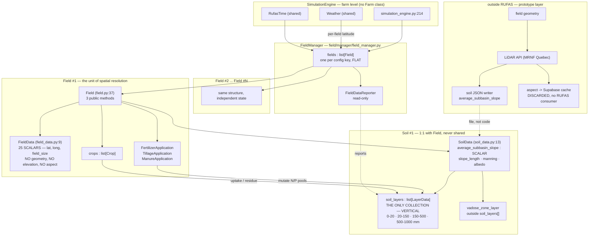

# RUFAS field representation — current model and multi-zone readiness

**Repository:** `C:\Proyectos\RuFaS-MyForageSystem`
**Branch / commit:** `research/andrea-msf-prototype` @ `1944199`
**Scope:** `RUFAS/biophysical/field/field/` (the field entity), read against its containing package
**Method:** AST parsing and targeted reads. No RUFAS module imported, no RUFAS code executed.
**Task:** RUFAS #4, advanced from 27 August.

> **Headline: a `Field` is a single point with a vertical soil column, and nothing more.**
> There is no horizontal dimension anywhere in RUFAS — no geometry, no coordinates beyond one
> lat/long pair, no elevation, no aspect, no sub-field unit. Slope exists as **one scalar on
> `SoilData`**, not as a spatial surface. Supporting Slava's representative-locations approach is
> therefore an *additive* change, not a refactor: the natural unit to replicate already exists
> (`Field` itself), and `FieldManager` already manages a collection of them. §6 sets out what that
> costs.

---

## 1. Package inventory

**Full path:** `RUFAS/biophysical/field/field/`

| File | Lines | Bytes | Class |
| --- | ---: | ---: | --- |
| `field.py` | 1,928 | 81,394 | `Field` |
| `manure_application.py` | 636 | 29,493 | `ManureApplication` |
| `tillage_application.py` | 365 | 16,090 | `TillageApplication` |
| `fertilizer_application.py` | 175 | 7,322 | `FertilizerApplication` |
| `field_data.py` | 167 | 7,716 | `FieldData` |
| `__init__.py` | 0 | 0 | — |
| **Total** | **3,271** | | 5 classes |

**Package-level exports: none.** Every `__init__.py` in the `field/` tree is **0 bytes** —
`field/`, `field/field/`, `field/soil/`, `field/crop/`, `field/manager/`. Nothing is re-exported;
every import states a full dotted path.

### Principal methods

| Class | Public surface |
| --- | --- |
| `Field` (43 methods total) | **3 public:** `manage_field(time, current_conditions, manure_applications)` → `list[HarvestedCrop]`; `check_manure_application_schedule(time)`; `perform_annual_reset()` |
| `FieldData` (dataclass, `kw_only`) | `perform_annual_field_reset()`; `convert_liters_to_millimeters(liter_amount, field_size)` *(static)* |
| `ManureApplication` | applies manure N/P to layers; 4 write sites into `LayerData` |
| `TillageApplication` | mixes surface + layer pools over tillage depth |
| `FertilizerApplication` | applies fertilizer N/P/K; receives the whole `Soil` object |

The containing package for context: `field/soil/` (30 modules, 10,125 lines), `field/crop/`
(18 modules, 5,140), `field/manager/` (8 modules, 4,023).

---

## 2. Current representation model

### 2.1 A `Field` is a single point

Evidence, all verbatim from source:

| Attribute | Location | Type | Spatial meaning |
| --- | --- | --- | --- |
| `absolute_latitude` | `field_data.py:71` (default `43.5`) | **scalar** | one point |
| `longitude` | `field_data.py:72` (default `-88.6`) | **scalar** | one point |
| `field_size` | `field_data.py:81` (default `1.0`) | **scalar**, ha | area only — no shape |
| `average_subbasin_slope` | `soil_data.py:199` (default `0.05`) | **scalar**, m/m | one slope for the whole field |
| `slope_length` | `soil_data.py:226` (default `3`) | **scalar** | one length |
| `seasonal_high_water_table` | `field_data.py:80` | **scalar** bool | uniform across the field |

There is **no** geometry, polygon, boundary, coordinate list, elevation, or aspect. Verified by
term sweep across `RUFAS/**/*.py`:

| Term | Result |
| --- | --- |
| `elevation`, `polygon`, `cell`, `raster`, `subfield`, `parcel` | **absent** |
| `aspect` | 5 files — all the English word ("aspects of the crop's lifecycle") or a matplotlib axis option |
| `zone` | 3 files — all `vadose_zone_layer`, a **vertical** concept |
| `grid` | 3 files — all `data_collection_app_updater.py` UI layout |
| `hru` | 4 files — **prose only**, in docstrings. No HRU class exists |
| `coordinate` | 2 files — plotting |

`field_size` is an **area with no shape**. A 10 ha field and a 10 ha field of a different form are
indistinguishable to the model.

### 2.2 Where each attribute lives

```
Field                          (field.py:37)      — behaviour, no spatial state of its own
├── field_data : FieldData     (field_data.py:9)  — 25 scalar attributes; NO collections
├── soil : Soil                (soil/soil.py:16)  — 1:1, never shared between Fields
│   └── data : SoilData        (soil_data.py:13)
│       ├── soil_layers : list[LayerData]         — the ONLY collection: VERTICAL
│       ├── vadose_zone_layer : LayerData         — single, below the profile
│       ├── average_subbasin_slope : float        — scalar
│       ├── slope_length, manning, albedo : float — scalars
│       └── machine_manure / grazing_manure : ManurePool
└── crops : list[Crop]                            — dynamic, not spatial
```

**Every spatial attribute is a scalar; the only collection is the vertical layer stack.**

`FieldData` holds 25 attributes across identity (`name`, lat/long, `minimum_daylength`), water
state (`transpiration`, `max_transpiration`, `max_evapotranspiration`, `current_residue`),
irrigation (6 fields), annual totals, and four `simulate_*_stress` booleans. **None is a list,
array, or nested structure.**

### 2.3 Moisture

Moisture is per-layer, not per-location: `LayerData.soil_water_concentration` (`layer_data.py:258`,
mm water/mm soil) and `LayerData.water_content` (`:259`, mm, computed at `:462` as
`soil_water_concentration × layer_thickness`). `SoilData` exposes profile aggregates —
`profile_soil_water_content` (`:461`), `profile_saturation` (`:485`), `profile_field_capacity`
(`:501`). All describe one column.

---

## 3. Layer handling

### 3.1 Count is configurable; the top layer is forced

Shipped config `input/data/soil/example_soil.json` declares **3** layers by `bottom_depth`:
150 mm, 500 mm, 1000 mm. The count is driven entirely by the JSON — `FieldManager._setup_soil`
(`field_manager.py:532`) sorts `soil_layers_config` by `bottom_depth` and builds one `LayerData`
per entry. **No maximum is enforced.**

### 3.2 `_subdivide_top_layer` — call site and result

Defined `soil_data.py:367`, called **once**, from `SoilData.__post_init__` at **`soil_data.py:334`**,
guarded:

```
soil_data.py __post_init__:
  if soil_layers[0].bottom_depth < 20   -> ValueError (raised)
  elif soil_layers[0].bottom_depth > 20 -> _subdivide_top_layer(field_size)
```

It `deepcopy`s layer 0, sets the copy's `bottom_depth = 20`, pushes the original's `top_depth` to
20, re-runs `__post_init__` on both, and inserts the copy at index 0. Its docstring gives the
reason: *"a top layer of soil that is 20 mm deep is a necessity to properly execute SurPhos"* —
phosphorus, not hydrology.

**Runtime profile from the shipped config — 4 layers:**

| Index | Depth |
| ---: | --- |
| 0 | 0–20 mm *(inserted)* |
| 1 | 20–150 mm |
| 2 | 150–500 mm |
| 3 | 500–1000 mm |

Plus `vadose_zone_layer`, constructed at `soil_data.py:336-337` with `top_depth` = the deepest
layer's bottom, held **outside** `soil_layers[]`. Code that iterates `soil_layers` therefore
misses it — `field_data_reporter.py` reports it separately (lines 1359-1411).

### 3.3 Per-layer vs aggregate consumers

| Iterates layers | Uses aggregates only |
| --- | --- |
| `PhosphorusMineralization` (writes 7 fields, all layers) | `SoilErosion` — `average_clay_percent`, profile totals |
| `NitrogenCycling` leaves — `denitrification`, `leaching_runoff_erosion`, `mineralization_decomp` | `Infiltration` — profile capacity |
| `CarbonCycling` leaves — `decomposition`, `pool_gas_partition`, `residue_partition` | `Evaporation` — depth-distributed demand, but by depth not index |
| `Percolation` — layer-to-layer routing | `Snow`, `SoilTemp` surface calculations |
| `SolublePhosphorus` — layer 0 + vadose | `Field._cycle_water` — totals |
| Crop uptake via `get_vectorized_layer_attribute` / `set_vectorized_layer_attribute` | `growth_constraints` — scalar stresses |

The vectorized accessors (`soil_data.py:395`, `:412`) are the general mechanism: pull one named
attribute across all layers into a list, mutate, write back. **They address layers by string name
and index — nothing prevents a caller touching any layer field.**

---

## 4. Multi-instance support

### 4.1 Yes — already fully supported

`FieldManager.__init__` (`field_manager.py:53-63`) builds **one `Field` per key** in the config
mapping:

```python
for field_name, field_configuration_data in field_data.items():
    new_field = self._setup_field(field_name, field_configuration_data, available_crop_configs)
    self.fields.append(new_field)
```

**Container: a plain `list[Field]`** (`field_manager.py:55`). Not a dict, not a tree. Lookup by name
is done by filtering (`field_manager.py:103`).

### 4.2 There is no Farm

**No `Farm` class exists in RUFAS** — verified across all class definitions. The farm-level role is
played by `SimulationEngine`, which owns one `FieldManager` (`simulation_engine.py:214`) alongside
`HerdManager`, `FeedManager`, `ManureManager`, and `EEEManager`.

```
SimulationEngine                    (farm level)
└── FieldManager                    (field collection)
    └── fields : list[Field]        (N fields, flat)
```

### 4.3 Shared vs per-field state

| Shared across all fields | Per-field (owned by each `Field`) |
| --- | --- |
| `Weather` — one object; `get_current_day_conditions(time, latitude)` is called **per field** with that field's latitude (`field_manager.py:94`) | `FieldData` — including its own lat/long |
| `RufasTime` — one simulation clock | `Soil` → `SoilData` → `LayerData[]` — **never shared** |
| `OutputManager`, `InputManager` singletons | `crops : list[Crop]` |
| `CropDataFactory` class-level config | 5 event schedules (planting, harvest, tillage, fertilizer, manure) |
| `GeneralConstants`, `UserConstants` | `FertilizerApplication`, `TillageApplication`, `ManureApplication` |
| `FieldDataReporter` — holds `fields=self.fields` | — |

**No market or price state exists anywhere** — economics is input data under `input/data/EEE/econ/`,
consumed by `RUFAS/EEE/`, with no code-level model (see `docs/rufas_architecture_map.md` §4.6).

The per-field latitude call is the one place the design already anticipates spatial variation
between fields — its docstring says so: *"Because different fields can have different latitudes,
the day length has to be recalculated for each field."*

---

## 5. External connections

### 5.1 Readers and writers

| Module | Reads | Writes |
| --- | --- | --- |
| `field/manager/field_manager.py` | `field.field_data.name`, `.absolute_latitude`, `field.harvest_events` | **constructs** every `Field`; calls `manage_field`, `perform_annual_reset` |
| `field/manager/field_data_reporter.py` | `field.soil.data.*`, `field.crops`, `crop.data.*`, `vadose_zone_layer` | nothing — read-only |
| `field/crop/crop.py` | `field_data` (stress flags, `max_transpiration`), `soil`, `soil_data` | `crop_data`, `SoilData` layer nutrients |
| `field/field/{fertilizer,manure,tillage}_application.py` | `soil` / `soil.data` | `LayerData` N/P pools, surface pools |
| `field/soil/**` (30 modules) | `SoilData` | `SoilData` / `LayerData` in place |
| `RUFAS/simulation_engine.py` | `FieldManager` | drives the daily loop |
| `RUFAS/EEE/**` | **nothing from `Field`** | — |

`SoilData` is imported by **34 of 173** biophysical modules — the widest blast radius in the
codebase.

### 5.2 Spatial data entering Field today

**Exactly one value: `average_subbasin_slope`**, and it arrives as a **soil property, not a field
property.** Path:

```
input/data/soil/*.json  ("average_subbasin_slope": 0.02)
  -> InputManager
  -> FieldManager._setup_soil        (field_manager.py:544, in expected_values)
  -> SoilData(average_subbasin_slope=...)
  -> consumed ONLY by SoilErosion    (soil_erosion.py:86, 93-95)
```

It feeds the MUSLE topographic factor, time of concentration, and exponential term. **Nothing else
in RUFAS reads slope** — not runoff, not infiltration, not percolation.

Because slope lives on `SoilData`, two fields sharing a `soil_specification` necessarily share a
slope, and a field cannot vary slope independently of its soil profile.

### 5.3 The slope/aspect openspec proposal

`openspec/changes/integrate-slope-aspect-api/` (proposal 8,688 B; design 8,733 B; tasks 5,279 B),
authored 2026-07-29, status *Draft — pending team validation*.

**How it connects to `Field`: it does not.** Explicitly out of scope —
*"**Modifying RUFAS core.** This change only writes into an existing RUFAS input file
(`example_soil.json`). No changes to Python code under `RUFAS/`."*

The flow is **outside** the simulation:

```
field geometry -> Jérémie Durand's LiDAR API (MRNF Quebec)
  -> TopographicResult(slope_deg, aspect, STAC id)
  -> Supabase STAC cache (cold ~7 s, cached ~1.4 s)
  -> soil_json_writer: slope_deg -> fraction (m/m) -> average_subbasin_slope
  -> RUFAS reads the JSON as normal
```

Three points that matter for multi-zone:

- **Aspect is fetched but discarded** — *"RUFAS does not have any aspect input, variable, or
  equation today."* Cached in Supabase for future specs.
- **One field at a time.** *"Batch geometries... Multi-field orchestration is a future spec."*
- **It already accepts a field geometry as input** — the runners (`run_prototype.py`,
  `run_multiyr_sweep.py`, …) take a geometry and orchestrate API → CSV → simulation. **Geometry
  exists in the prototype layer; it just never reaches RUFAS.**

The proposal prose says it materialises slope into `example_soil.json`, which is **CI-protected**
(`.claude/rules/protected-inputs.md` lists `example_*` under `input/data/soil/`). `tasks.md:67-69`
resolves this — write "either overwriting a per-run copy or to a new file" — but `proposal.md:37-39`
still reads as an in-place edit. Worth aligning before implementation.

---

## 6. Structure diagram



---

## 7. Findings for the representative-locations approach

### 7.1 What would have to change

The good news: **`Field` is already the replicable unit, and `FieldManager` already holds a list of
them.** A representative location is structurally identical to what RUFAS calls a field.

| Option | Change | Cost |
| --- | --- | --- |
| **A — locations as Fields** | Emit N config entries per real field; add a grouping key (e.g. `parent_field_id`) to `FieldData`; aggregate outputs by that key in `FieldDataReporter` | **low.** No change to `Field`, `Soil`, or any process module. Uses the existing loop |
| **B — locations inside Field** | Give `Field` a `list[Soil]` instead of one `Soil` | **high.** `self.soil` is assumed singular at ~40 call sites in `field.py` alone; `FertilizerApplication`/`Tillage`/`Manure` each hold one `soil` reference; `FieldDataReporter` assumes one profile per field |
| **C — locations as extra layers** | Reuse `soil_layers[]` horizontally | **wrong.** The list is depth-ordered and every process assumes vertical adjacency (`percolation` routes layer *i* → *i+1*) |

**Option A is the only one that does not fight the existing design.**

### 7.2 Shared vs per-location state

| Would be shared | Must be per-location |
| --- | --- |
| `Weather` — already shared, already re-evaluated per field latitude | `SoilData` + `LayerData[]` (texture, moisture, slope) |
| `RufasTime` | crop state — plants grow differently under different water/nutrient regimes |
| Event schedules — the same operations happen on the whole field | `FieldData.field_size` — locations must partition the area, or totals double-count |
| Machinery / operation type | derived water balance, runoff, erosion |
| `OutputManager`, constants | — |

**The `field_size` trap:** it is used to convert masses to areal densities throughout
(`convert_liters_to_millimeters`, `LayerData._add_phosphorus_to_pool`, `SoilErosion.erode`). If N
locations each carry the full field area, every mass-balance output is inflated N-fold. Locations
must either carry a fraction of the area or be explicitly weighted at aggregation.

### 7.3 Hooks that could be reused

- **`FieldManager._setup_field`** (`field_manager.py:149`) — the single construction site. Emitting
  N locations means calling it N times; no new machinery.
- **Per-field weather resolution** (`field_manager.py:94`) — already resolves conditions per field
  latitude. Extends to per-location without change.
- **`FieldDataReporter(fields=self.fields)`** — already takes the whole collection, so aggregation
  logic has a natural home.
- **`get_vectorized_layer_attribute` / `set_vectorized_layer_attribute`** — a general
  attribute-across-collection accessor. The pattern (not the instance) generalises to locations.
- **`prototype_msf/` runners** — already accept a **field geometry** and orchestrate outside RUFAS.
  If locations are derived from geometry (e.g. slope classes from the LiDAR raster), that derivation
  belongs here, matching the existing proposal's architecture.

### 7.4 Hard-coded one-point-per-field assumptions

| Assumption | Location | Severity for multi-location |
| --- | --- | --- |
| `Field` owns exactly one `Soil` | `field.py:116` — `self.soil = soil or Soil(...)` | **high** for option B; none for option A |
| One lat/long per field | `field_data.py:71-72` | low — locations get their own |
| Slope lives on `SoilData`, not `FieldData` | `soil_data.py:199` | **medium** — locations differing only by slope must each carry a full soil config |
| `field_size` is the whole field | `field_data.py:81`, used in every mass conversion | **high** — see §7.2 |
| `0.02` hardcoded as min cover-management factor | `field.py:1524` | low, but it means erosion is not fully config-driven |
| Applicators hold one `soil` reference each | `field.py:126, 135, 139` | **high** for option B |
| `soil_layers` is depth-ordered and adjacent | `percolation.py`, `soil_data.py:532` sort | **fatal** for option C |

### 7.5 There was a compaction prototype — removed 2026-08-20

> **Update, 2026-08-20:** `prototype_msf/compaction_model.py` and its dependent
> `prototype_msf/compare_contact_models.py` were **removed** in the commit that carries this
> note. The sigma_pc coefficients and 0.5 / 1.1 risk bands came from the `soilphysics` package
> source, which attributes them to Schjonning & Lamande (2018) and Stettler et al. (2014) —
> **neither primary source was read directly**, so under the project rule that sources must be
> read directly the module could not be validated. Both files remain in git history at
> `dd8d908`, `a3fe008`, `9db8997`, `9ffaed5`, `b930699`. The section below is retained as a
> record of what the prototype established; it describes code that is no longer in the tree.

`prototype_msf/compaction_model.py` (440 lines) implemented an independent compaction chain —
machinery → dynamic axle load (Carranza-Díaz et al.) → contact area (Grecenko 1995) → applied
stress → bulk density (Perreault et al. 2022) → precompression stress → GREEN/YELLOW/RED. It was
**not imported by anything under `RUFAS/`**.

Two things it settled for the Terranimo mapping — both still true, since they concern what data
exists rather than which model consumes it:

- **`evaluate_compaction_risk`** took exactly the variables the mapping listed as missing from
  RUFAS: `total_diameter_m` (D), `static_load_radius_m` (SLR), `section_width_m` (W),
  `inflation_pressure_kPa` (ptyre), `tire_load_kN` (FW), `matric_suction_hPa`,
  `organic_matter_pct`. The machinery data gap is real for RUFAS, and it was the *shape* of that
  input set — not the removed implementation — that the mapping relies on.
- **`organic_carbon_from_om`** used the van Bemmelen factor 1.724 explicitly. Assumption 1 in
  `docs/rufas_terranimo_io_mapping.md` §4.3 was settled by that usage; with the module removed,
  the factor is now documented only in `prototype_msf/irda_soil_database.md` (the IRDA guide
  gives MOS "calculee avec un facteur 1,724"), so the assumption still holds but its in-code
  precedent is gone.

The compaction gap is expected to be filled by the Terranimo API integration (current sprint) or
by the model Slava Adamchuk has coming.

---

## Provenance

Produced at commit `1944199` by AST parsing and targeted reads of the files cited. Line numbers,
defaults, and units are verbatim from RUFAS source and docstrings. No RUFAS module was imported and
no RUFAS code was executed. Negative findings ("absent") are name-based across `RUFAS/**/*.py`;
dynamically constructed names would not be visible to this method. The openspec proposal is read as
authored and is marked *Draft — pending team validation*; it does not describe merged behaviour.
