# Architectural options — phosphorus and compaction handling

**Repository:** `C:\Proyectos\RuFaS-MyForageSystem`
**Branch / commit:** `research/andrea-msf-prototype` @ `693e293`
**Task:** RUFAS #7 (sprint plan)
**Status:** preliminary — for review, not a final call

## Evidence base and method

This document reasons from six committed analyses. No new RUFAS source inspection was performed
for it.

**One external source is also cited**, in §4.1 only: an email consultation with Dr. Zhiming Qi
(McGill Brace Water Centre) on 24 jul 2026 concerning RZWQM2-Phosphorus. It is primary
correspondence, not an inference, and is attributed inline where used.

| Doc | Short form used below |
| --- | --- |
| `docs/rufas_architecture_map.md` | **MAP** |
| `docs/rufas_phosphorus_deep_dive.md` | **PHOS** |
| `docs/rufas_plant_growth_analysis.md` | **GROW** |
| `docs/rufas_hydrology_architecture.md` | **HYDRO** |
| `docs/rufas_field_representation.md` | **FIELD** |
| `docs/rufas_terranimo_io_mapping.md` | **TERRA** |

> **[INFERENCE] tagging.** Every effort estimate, reversibility rating, matrix score, risk
> judgement and recommendation in this document is an **inference** — the source documents record
> structure and facts, not verdicts. Rather than tag each cell individually, note that:
> **§1 "Description", "Implementation steps", "Effort", "Reversibility", "Risks"; all of §2; all of
> §3; and all of §4 are [INFERENCE].** The "Files", "Evidence for" and "Evidence against" fields
> are traceable to the cited documents and are **not** inferences. Individual inferences that go
> notably beyond the evidence are tagged inline as well.

---

## 1. Option evaluations

### Option A — Keep

**Description.** Leave RUFAS phosphorus cycling exactly as it is and add no compaction capability.
The five-module `phosphorus_cycling` package continues to run once per field-day from
`field.py:1528`, and no external model is introduced. This is the do-nothing baseline against
which the other three are measured.

**Implementation steps.** *[INFERENCE]*

1. No code change.
2. Optionally record the decision and its rationale in the openspec change log.
3. Close the compaction line of work for this sprint.

**Files modified.** None.

**Effort: Low.** *[INFERENCE]* Zero implementation. The only cost is documenting the decision.

**Reversibility: Easy.** *[INFERENCE]* Nothing is undone because nothing is done.

**Alignment with flat design intent (`field.py:1491-1493`).** **Perfect** — it changes nothing, so
it cannot conflict with the stated preference for a flat, reorderable structure (HYDRO §5.4).

**Risks.** *[INFERENCE]*

- Does not deliver the sprint objective. Compaction remains absent from RUFAS: TERRA §4.2 records
  that **every** Terranimo output currently has no consumer, and there is no compaction field,
  module, or reporting variable anywhere.
- The motivating problem stands. FIELD §5.3 quotes the openspec proposal: the model *"can recommend
  applying manure on a day that appears safe but that on a sloped field would generate significant
  runoff toward a watercourse."*
- Phosphorus keeps its known structural weaknesses: no single owner (MAP §4.1), four modules
  outside the package mutating the same pools with two of them bypassing the `LayerData` accessor
  (PHOS §4.3).

**Evidence supporting.**

- The phosphorus package is internally coherent: one live entry point, a fixed four-step order,
  and no component calling another (PHOS §2.1).
- Nothing is currently broken in a way that forces action: GROW §4.3 found **no dead computation in
  the crop package**; the growth chain uptake → stress → growth factor → biomass is fully live.
- MAP §5 records **zero circular imports** across all 404 in-scope edges — the core is a clean DAG.

**Evidence against.**

- TERRA §4.2 — no compaction consumer exists, so the capability gap is total.
- PHOS §4.3 — the phosphorus write side is entangled: `crop_management.py` and
  `fertilizer_application.py` use raw `+=` while `manure_application.py` and
  `tillage_application.py` go through the accessor. Two conventions for one field.
- MAP §5 — `SoilData` is imported by **34 of 173** modules, so this ambiguity has the widest blast
  radius in the codebase and does not improve by waiting.

---

### Option B — Combine

**Description.** Keep RUFAS's structure and substitute or augment individual routines, swapping one
calculation at a time rather than replacing a subsystem. For compaction this means adding a
Terranimo call as a new cross-cutting consumer alongside the existing daily order; for phosphorus it
means replacing single components inside `cycle_phosphorus` if and when a better one exists.

**Implementation steps.** *[INFERENCE]*

1. Add a topographic/compaction service outside `RUFAS/`, following the pattern the openspec
   proposal already uses (FIELD §5.3).
2. Source the six missing machine inputs — tyre UID, geometry, inflation pressure, wheel load
   (TERRA §1.4) — from farm records or operator input.
3. Chain the four Terranimo endpoints: matric-potential helper → precompression (×2 layers) →
   recommended-pressure helper → compaction risk (TERRA §5).
4. Add a consumer for the `result` verdict at the start of the manure-application loop
   (`field.py:177-191`), per TERRA §3.1.
5. For phosphorus, leave `cycle_phosphorus` intact; swap individual components only if a validated
   replacement appears, using hook 4 from PHOS §4.1.

**Files modified.**

- New service module outside `RUFAS/` — no existing path
- `RUFAS/biophysical/field/field/field.py` (consumer at the manure loop)
- possibly `RUFAS/biophysical/field/field/manure_application.py`
- input/config plumbing for the machine data

**Effort: Medium.** *[INFERENCE]* HYDRO §5.2 rates "swap one routine for a same-signature
alternative" as **low** — one construction line plus one call line, no interface to satisfy. The
Medium rating comes not from the swap but from TERRA §4.1: sourcing tyre identity, geometry and
inflation pressure is rated **high severity** and is *"not a mapping problem — it is missing domain
data."*

**Reversibility: Easy.** *[INFERENCE]* A one-routine swap is undone by reverting one construction
line (HYDRO §5.2). Adding a consumer at one call site is likewise a single-site revert.

**Alignment with flat design intent.** **Strong.** `field.py:1491-1493` states the flat structure
exists *"to allow for SMEs to more easily and freely experiment with different orders of
processes"* (HYDRO §3.1). Swapping one routine and adding one consumer is exactly that kind of
experimentation, and requires no abstraction layer.

**Risks.** *[INFERENCE]*

- The machine-data gap is the binding constraint, not the code. TERRA §1.4: **6 of 13 inputs are
  absent from RUFAS**, and *"every soil input is available or derivable. No machine input is."*
- Call volume. TERRA §4.3 assumption 8 records that Terranimo has **no batch endpoint** and
  documents no rate limit, so this is one HTTP call per wheel × layer × timestep.
- Unit ambiguity. TERRA §4.1 notes matric potential appears as **bar, hPa, cbar and cBar** across
  different Terranimo schemas.
- Ordering is implicit. HYDRO §5.1 rates ordering coupling **tight** — order exists only as
  statement order in `_cycle_water`, so a new consumer's position matters and is not enforced.

**Evidence supporting.**

- HYDRO §5.2 — routine swap rated **low** cost; *"no interface to satisfy."*
- HYDRO §5.1 — **import coupling is loose**: each routine imports only `SoilData` (some also
  `LayerData`, `GeneralConstants`), so substitution is a one-line change at the construction site.
- MAP §7.4 — `RUFAS/EEE/` is a working precedent for a cross-cutting consumer: it imports exactly
  **one** symbol from `biophysical/` (`HarvestOperation`), touches no soil module, and is invoked
  from a single site.
- TERRA §3.2 — names EEE explicitly as the architectural precedent, and `data_structures` as the
  integration surface.
- PHOS §4.1 hook 4 — per-process substitution is available, *"allows keeping e.g. manure P while
  replacing mineralisation."*
- FIELD §5.3 — the openspec proposal already demonstrates the outside-RUFAS pattern: it writes into
  an input file and explicitly does **not** modify RUFAS core.

**Evidence against.**

- TERRA §4.1 — tyre identity/geometry and inflation pressure are **high severity** gaps with no
  RUFAS representation whatsoever.
- TERRA §5 — *"The chain is four calls, not two."*
- MAP §7.5 — the EEE precedent has a limit: its enums **carry no payload**, so wheel load and tyre
  pressure are not on that interface today.
- HYDRO §4.2 — **no configuration flag selects a hydrological method** anywhere in RUFAS; there is
  no precedent for model-selection plumbing.

---

### Option C — Bypass

**Description.** Disable RUFAS's phosphorus cycling and supply phosphorus state from an external
model, leaving the rest of the simulation intact. The natural hook is the single live call site at
`field.py:1528`, or the constructor seam in `Soil.__init__`.

**Implementation steps.** *[INFERENCE]*

1. Choose a hook from PHOS §4.1 — `field.py:1528` (visible ordering) or `Soil.__init__` at
   `soil.py:58` (substitutable seam, no `Field` edit).
2. Set `simulate_phosphorus_stress = False` per field
   (`field_manager.py:233` → `growth_constraints.py:130-134`).
3. **Gate crop uptake as well** — GROW §4.1 establishes that uptake is *not* gated by the stress
   flag.
4. Zero **outputs, not inputs** — PHOS §4.2 records a `ZeroDivisionError` at `layer_data.py:475`
   during `LayerData.__post_init__` if `mean_phosphorus_sorption_parameter` is zero.
5. Feed external phosphorus state into `SoilData`, or accept that the ~40 reported phosphorus
   variables go to zero.

**Files modified.**

- `RUFAS/biophysical/field/field/field.py` (line 1528)
- or `RUFAS/biophysical/field/soil/soil.py` (line 58)
- `RUFAS/biophysical/field/crop/crop.py` (uptake gating — step 4 of `perform_daily_crop_update`)
- per-field input JSON (`simulate_phosphorus_stress`)

**Effort: Medium.** *[INFERENCE]* Each individual change is small, but GROW §4.1 shows the bypass
is **three coordinated changes, not one** — stress flag, cycling call, and uptake gating — and
getting only two of them produces a silently wrong state (see Risks).

**Reversibility: Medium.** *[INFERENCE]* Code changes revert cleanly, but any simulation run under
bypass produces phosphorus outputs that diverge from reference; PHOS §4.2 notes *"any downstream
comparison against reference outputs would diverge."*

**Alignment with flat design intent.** **Neutral to weak.** A guard at `field.py:1528` respects the
flat structure. But GROW §4.1's three-change requirement spreads the bypass across `field.py`,
`crop.py` and config — the opposite of a single reorderable step.

**Risks.** *[INFERENCE]*

- **The headline trap.** GROW §4.1: *"turning off the stress flag does not stop the crop consuming
  soil phosphorus."* Uptake runs at step 4 of `perform_daily_crop_update`, before constraint
  evaluation at step 5, and is not gated. A bypass built from the flag alone leaves the soil P drain
  fully active.
- Combined with a soil-side bypass this produces *"a monotonically draining labile P pool with no
  replenishment — not a crash, but not a physically meaningful run either"* (GROW §4.1).
- Zeroing the wrong end crashes at construction: `ZeroDivisionError` at `layer_data.py:475`
  (PHOS §4.2).
- Four modules outside the phosphorus package still write to the same pools (PHOS §4.3), so a
  bypass at the cycling call does not stop all phosphorus mutation.

**Evidence supporting.**

- PHOS §4.1 — **one live call site**, and four candidate hooks ranked by cost.
- PHOS §4.2 — *"Nothing raises, and one consumer is already inert."* The P→N coupling is dead
  computation (`return 1`, issue #2990), so bypassing phosphorus does **not** perturb nitrogen.
- PHOS §4.2 — an **official off-switch already exists**: `simulate_phosphorus_stress`, alongside
  the water/temperature/nitrogen equivalents.
- GROW §2.4 — because `growth_factor = 1.0 - max(...)`, phosphorus only changes yield when it is
  the binding constraint; on other days zeroing it changes nothing.
- PHOS §4.1 hook 2 — `Soil.__init__` is a genuine substitutable seam that *"composes with the
  existing constructor pattern... without touching `Field`."*

**Evidence against.**

- GROW §4.1 — the flag is a **partial** solution; three coordinated changes are required.
- PHOS §4.2 — the division-by-zero risk means the safe direction (zero outputs) must be chosen
  deliberately.
- PHOS §4.3 — the write side is more entangled than the read side; four external modules mutate
  phosphorus pools.
- TERRA §4.2 — even with phosphorus bypassed, there is still **no consumer** for a compaction
  verdict, so bypass alone does not deliver compaction.

---

### Option D — Parallel

**Description.** Run an alternative phosphorus and/or compaction model alongside RUFAS on the same
inputs, comparing outputs rather than replacing anything. RUFAS keeps producing its own values; the
parallel model produces a second set for evaluation.

**Implementation steps.** *[INFERENCE]*

1. Build an extraction layer to snapshot per-layer soil state each timestep (TERRA §2 sketches this
   as a component "to build").
2. Build a unit-conversion layer (TERRA §2, also "to build").
3. Run the external model on the extracted state.
4. Store and compare both output sets.
5. Build reporting to present the comparison.

**Files modified.**

- Entirely new modules outside `RUFAS/`
- possibly `RUFAS/biophysical/field/manager/field_data_reporter.py` for comparative reporting

**Effort: High.** *[INFERENCE]* TERRA §2 marks both the extraction layer and the conversion layer as
**"(to build)"** — neither exists. HYDRO §5.2 rates *"delegate hydrology to an external engine"* as
**high**, because *"nothing exists to build on: no serialisation, no adapter, no file format, no
process boundary, no dependency. It would be new construction, not integration."* [INFERENCE] The
same reasoning transfers to phosphorus and compaction: the missing scaffolding is identical.

**Reversibility: Easy.** *[INFERENCE]* Nothing in RUFAS changes, so the parallel path can simply be
switched off. This is Option D's strongest property.

**Alignment with flat design intent.** **Neutral.** It adds nothing to `_cycle_water` and so does
not conflict with `field.py:1491-1493`. [INFERENCE] It neither honours nor violates the intent —
it sidesteps it.

**Risks.** *[INFERENCE]*

- Double state management with no shared contract. MAP §5 records that `SoilData` has **no
  mechanism marking which fields a given process may touch**, so keeping a parallel copy consistent
  is unguarded.
- Highest build cost for the least immediate capability: it produces a comparison, not a decision
  input.
- TERRA §4.2 — the comparison still has no consumer inside RUFAS.

**Evidence supporting.**

- Zero risk to existing behaviour — no RUFAS file is modified, so MAP §5's 34-of-173 `SoilData`
  blast radius is untouched.
- FIELD §5.3 — the openspec proposal already establishes an outside-RUFAS pattern that changes no
  Python under `RUFAS/`.
- [INFERENCE] It is the only option that produces a **direct numerical comparison** between RUFAS
  phosphorus and an alternative, which is what would be needed to justify B or C on scientific
  grounds.

**Evidence against.**

- HYDRO §5.2 — external-engine delegation is **high** cost with no existing scaffolding.
- TERRA §2 — both the extraction and conversion layers are marked "to build".
- TERRA §4.3 assumption 8 — no batch endpoint, so a parallel run multiplies call volume.
- FIELD §7.5 — the most recent attempt at an independent model (`compaction_model.py`) was
  **removed on 2026-08-20** because its primary sources were never read directly. [INFERENCE] A
  parallel model faces the same validation burden that ended that attempt.

---

## 2. Comparison matrix

All cells are **[INFERENCE]**. Scale: 1 = worst, 5 = best, except where a word rating is given.

| | **A Keep** | **B Combine** | **C Bypass** | **D Parallel** |
| --- | --- | --- | --- | --- |
| **Effort** | **Low (5)** — no code change | **Medium (3)** — routine swap is low (HYDRO §5.2); machine data is the cost | **Medium (3)** — three coordinated changes (GROW §4.1) | **High (1)** — two layers "to build" (TERRA §2) |
| **Reversibility** | **Easy (5)** — nothing done | **Easy (5)** — revert one construction line (HYDRO §5.2) | **Medium (3)** — code reverts, but runs diverge from reference (PHOS §4.2) | **Easy (5)** — no RUFAS file touched |
| **Design-intent fit** (`field.py:1491`) | **Perfect (5)** — changes nothing | **Strong (5)** — one-routine experimentation is the stated purpose | **Neutral (3)** — spreads across 3 files | **Neutral (3)** — sidesteps the question |
| **Scientific rigor** | **Low (2)** — leaves known ambiguity (PHOS §4.3) | **Medium (4)** — Terranimo is externally maintained; but 8 assumptions open (TERRA §4.3) | **Medium (3)** — depends entirely on the replacement's provenance | **High (5)** — comparison is the strongest evidence-generating design |
| **Risk level** | **Low (4)** — no new failure modes; misses the objective | **Medium (3)** — call volume, unit ambiguity, implicit ordering | **High (2)** — silent partial-bypass trap (GROW §4.1); crash if inputs zeroed (PHOS §4.2) | **Medium (3)** — no RUFAS risk; validation burden (FIELD §7.5) |
| **Integration cost** | **None (5)** | **Medium (3)** — 6 of 13 inputs absent (TERRA §1.4); 4-call chain (TERRA §5) | **Low–Medium (4)** — hooks exist and are enumerated (PHOS §4.1) | **High (1)** — no serialisation, adapter, or boundary (HYDRO §5.2) |
| **Time to implement** | **Immediate (5)** | **Medium (3)** — gated by machine-data sourcing, not code | **Short (4)** — three small edits, once the replacement exists | **Long (1)** — new construction |
| **Total (of 35)** | **31** | **26** | **22** | **19** |

> **[INFERENCE] on the totals.** The column sum treats all seven criteria as equally weighted, which
> is a modelling choice, not a finding. Option A scores highest largely because "do nothing" is
> cheap and safe — the ranking inverts if delivering compaction capability is weighted as a
> requirement rather than a criterion. Read the rows, not the total.

---

## 3. Killer criteria

Issues that would eliminate an option regardless of its other merits.

### 3.1 Design-intent violation

`field.py:1491-1493` states the flat structure is *"a conscious design choice"* enabling SMEs to
*"experiment with different orders of processes"* (HYDRO §3.1, §5.4). HYDRO §5.4 warns any proposal
must *"contend with"* it.

| Option | Verdict |
| --- | --- |
| A | Not triggered |
| B | Not triggered — arguably the intent's best expression |
| C | **Not triggered, but strained** *[INFERENCE]* — three files is not one reorderable step |
| D | Not triggered — does not touch `_cycle_water` |

**Kills: none.**

### 3.2 Fabrication risk

FIELD §7.5 records a concrete precedent: `compaction_model.py` was **removed on 2026-08-20** because
its sigma_pc coefficients and 0.5/1.1 risk bands came from a package source attributing them to
Schjonning & Lamande (2018) and Stettler et al. (2014), *"neither primary source was read
directly."*

| Option | Verdict |
| --- | --- |
| A | Not triggered — no new claims |
| B | **Conditional** — Terranimo is externally maintained, but TERRA §4.3 lists **8 open assumptions**, including the OC→OM factor and whether `tyreLoad` is mass or force |
| C | **Triggered if the replacement is unvalidated** *[INFERENCE]* — bypass is only as sound as what replaces it; an unvalidated replacement repeats the removed-module pattern |
| D | **Conditional** — same burden as C, but produces comparison data that could *discharge* it |

**Kills: none outright.** It disqualifies any *specific* replacement whose sources cannot be read
directly — a constraint on execution, not on option choice.

### 3.3 Infrastructure absence

HYDRO §5.2: external-engine delegation is high cost because *"nothing exists to build on: no
serialisation, no adapter, no file format, no process boundary, no dependency."* TERRA §2 marks the
extraction and conversion layers as "to build". HYDRO §4.1: RUFAS has only **three ABCs** and
**`typing.Protocol` is used nowhere**; the soil hydrology routines have **no abstract base at all**.
HYDRO §4.2: **no config flag selects a model** anywhere.

| Option | Verdict |
| --- | --- |
| A | Not triggered |
| B | Partially — no model-selection precedent, but the swap itself needs none (HYDRO §5.2) |
| C | Partially — hooks exist and are enumerated (PHOS §4.1) |
| D | **Strongly triggered** — requires the most absent infrastructure of the four |

**Kills: none, but it is the decisive cost driver for D.**

### 3.4 Verification impossibility

TERRA §4.2: **every** Terranimo output currently has no consumer in RUFAS; `sci` is *"unusable — the
spec gives no unit, range, or interpretation."* TERRA §1.5: the layer alignment between Terranimo's
"layer 1"/"layer 4" and RUFAS's runtime layers is *"unverifiable — Terranimo documents neither."*

| Option | Verdict |
| --- | --- |
| A | Not triggered — nothing new to verify |
| B | **Conditional** — layer-depth alignment is unverifiable from the spec alone; needs Stefan |
| C | Not triggered by the bypass mechanism itself |
| D | Not triggered — verification is its purpose |

**Kills: none.** But it blocks *completion* of B until the outstanding Terranimo questions are
answered.

### 3.5 Summary

**No option is eliminated by a killer criterion.** *[INFERENCE]* The criteria instead sort the
options by execution risk: D is heaviest on absent infrastructure, C carries the highest silent-
failure risk, B is gated on external answers, and A carries no execution risk but delivers nothing.

---

## 4. Preliminary recommendation

### 4.1 Recommendation

**[INFERENCE] Option B (Combine), scoped to compaction only, with phosphorus left as Option A
(Keep) for this sprint.**

The four options are usually posed as alternatives, but the evidence separates cleanly into two
questions:

- **Compaction** — RUFAS has no capability at all (TERRA §4.2). Anything is additive; nothing can
  regress.
- **Phosphorus** — RUFAS has a working, internally coherent package (PHOS §2.1) with no dead
  computation in its consumer chain (GROW §4.3). Replacing it needs a validated alternative that
  does not currently exist, following the removal recorded in FIELD §7.5.

Splitting them lets the sprint deliver compaction without taking on phosphorus-replacement risk.

Why B for compaction:

- HYDRO §5.2 rates the mechanism **low** cost — *"no interface to satisfy."*
- MAP §7.4 and TERRA §3.2 give a working precedent: EEE is a cross-cutting consumer importing
  **one** symbol from `biophysical/`.
- TERRA §3.1 identifies a concrete first consumer — the manure-application loop at
  `field.py:177-191` — which matches the motivating use case in FIELD §5.3.
- It honours the stated design intent rather than arguing against it (HYDRO §5.4).

Why A for phosphorus this sprint:

- PHOS §4.2 — the strongest argument for bypass (P→N coupling) turns out to be **inert**: the
  coupling is dead computation pending issue #2990. Bypassing phosphorus buys less than it appears.
- GROW §2.4 — phosphorus only affects yield when it is the binding constraint in
  `1.0 - max(...)`, so the behavioural payoff of replacing it is conditional.
- GROW §4.1 — a correct bypass needs three coordinated changes, with a silent-failure mode if only
  two are made.
- The most-recommended alternative — RZWQM2-Phosphorus, per Slava Adamchuk's July suggestion — was
  formally consulted with Dr. Zhiming Qi (McGill Brace Water Centre) via email on 24 jul 2026. Qi
  confirmed the P module cannot be executed independently; it requires the RZWQM2 parent model
  installed as a local .exe, making it incompatible with MSF's cloud pipeline architecture.
- Additionally, Qi noted the P module has not been validated on Quebec fields (only the water and
  nitrogen components have been tested there under freeze-thaw conditions). Using it in MSF would
  require both an architectural workaround and a Quebec validation study before deployment.

### 4.2 Confidence

**Medium.** *[INFERENCE]*

Supporting a higher rating: the structural facts are verified by AST analysis across six documents,
the hooks are enumerated with line numbers, and the precedent (EEE) is concrete.

Holding it down:

- TERRA §1.4 — **6 of 13 Terranimo inputs are absent from RUFAS**, and the machine half is
  *"not a mapping problem — it is missing domain data."* Whether that data can be sourced is
  unresolved and outside the code.
- TERRA §4.3 — **8 open assumptions**, several needing Stefan's confirmation.
- No option has been prototyped since `compaction_model.py` was removed (FIELD §7.5).

### 4.3 What would change the recommendation

| Finding | Effect |
| --- | --- |
| Machine data (tyre UID, geometry, inflation pressure) proves unobtainable | B becomes infeasible for compaction; D or A by default *[INFERENCE]* |
| Slava Adamchuk's model arrives validated with readable primary sources | Reopens C and D on rigour grounds (FIELD §7.5 records the model is expected) |
| Issue #2990 is resolved and P→N coupling is made live again | Strengthens the case against bypassing phosphorus (PHOS §4.2) |
| Terranimo confirms layer depths and the `tyreLoad` mass/force question | Raises confidence in B from Medium toward High (TERRA §1.5, §4.3) |
| Multi-location work (FIELD §7) proceeds first | Changes the unit of analysis; per-location compaction may multiply call volume — TERRA §4.3 assumption 8 notes there is no batch endpoint |

### 4.4 Open questions to resolve before a final call

1. **Can tyre and machinery data be sourced at all?** TERRA §4.1 rates this **high severity** with
   no RUFAS representation. This is the single largest unknown.
2. **What are Terranimo's layer depths?** TERRA §1.5 — the 4-layer count aligns by coincidence;
   depths are undocumented.
3. **Is `tyreLoad` a mass or a weight-force, and under what `g`?** TERRA §4.3 assumption 5.
4. **What call volume is acceptable?** No batch endpoint, no documented rate limit
   (TERRA §4.3 assumption 8).
5. **What does Slava's model require as input, and are its primary sources readable?** FIELD §7.5
   sets the validation bar that ended the previous attempt.
6. **Should phosphorus and compaction be decided together at all?** *[INFERENCE]* This document
   argues they should not; that framing needs confirmation.

---

## 5. Options and evidence map

```mermaid
flowchart TB
  subgraph findings["Findings from the six committed analyses"]
    F1["PHOS 4.1 — ONE live call site<br/>field.py:1528, 4 hooks enumerated"]
    F2["PHOS 4.2 — P to N coupling is DEAD<br/>return 1, issue #2990"]
    F3["GROW 4.1 — uptake NOT gated by flag<br/>bypass needs 3 changes"]
    F4["GROW 2.4 — growth_factor = 1 - max<br/>P matters only when binding"]
    F5["HYDRO 5.2 — routine swap = LOW<br/>external engine = HIGH"]
    F6["HYDRO 5.4 — field.py:1491<br/>flat design is deliberate"]
    F7["HYDRO 4.1/4.2 — 3 ABCs, no Protocol<br/>no model-selection flag"]
    F8["MAP 7.4 — EEE precedent<br/>cross-cutting consumer works"]
    F9["TERRA 1.4 — 6 of 13 inputs absent<br/>no machine data in RUFAS"]
    F10["TERRA 4.2 — NO consumer<br/>for any Terranimo output"]
    F11["TERRA 2 — extraction + conversion<br/>layers TO BUILD"]
    F12["FIELD 7.5 — compaction_model REMOVED<br/>sources not read directly"]
  end
  subgraph options["The four options"]
    OA["A — KEEP<br/>no change"]
    OB["B — COMBINE<br/>swap/add one routine"]
    OC["C — BYPASS<br/>disable RUFAS P"]
    OD["D — PARALLEL<br/>run alternative alongside"]
  end
  REC["RECOMMENDED<br/>B for compaction<br/>+ A for phosphorus<br/>confidence: MEDIUM"]
  F2 -->|supports| OC
  F1 -->|supports| OC
  F4 -->|weakens payoff| OC
  F3 -->|opposes| OC
  F5 -->|supports| OB
  F6 -->|supports| OB
  F8 -->|supports| OB
  F9 -->|opposes| OB
  F10 -->|opposes| OA
  F12 -->|opposes| OD
  F11 -->|opposes| OD
  F5 -->|opposes| OD
  F7 -->|opposes| OD
  F2 -->|weakens case for change| OA
  F4 -->|weakens case for change| OA
  OB ==> REC
  OA ==> REC
  OC -.not this sprint.-> REC
  OD -.not this sprint.-> REC
```

---

## Provenance

Written at commit `693e293`, reasoning only from the six documents listed at the top. No RUFAS
source was inspected for this document and no code was executed. All ratings, estimates, matrix
cells, killer-criteria verdicts and recommendations are **[INFERENCE]** as scoped in the method
note; the "Files", "Evidence supporting" and "Evidence against" fields cite the source documents
directly and are not inferences. Where a source document itself marks something as assumed or
unverified — notably TERRA §4.3's eight assumptions and TERRA §1.5's layer alignment — that status
is carried forward here rather than resolved.
