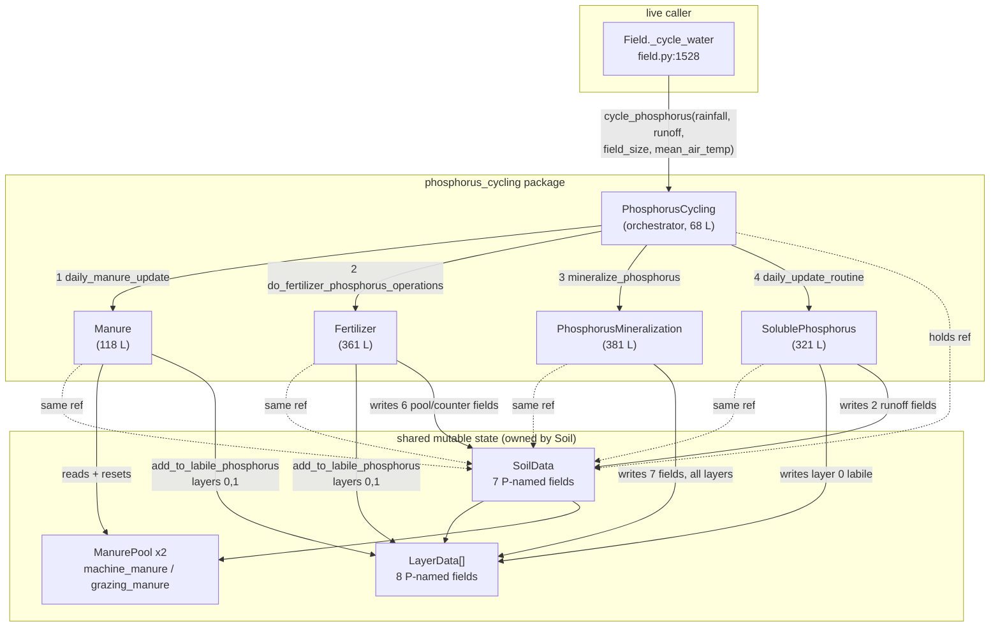

# RUFAS phosphorus package — deep dive

**Repository:** `C:\Proyectos\RuFaS-MyForageSystem`
**Branch / commit:** `research/andrea-msf-prototype` @ `905b9ae` (map corrections applied)
**Scope:** `RUFAS/biophysical/field/soil/phosphorus_cycling/` — 5 modules, 1,249 lines
**Method:** AST parsing and targeted reads. No RUFAS module imported, no RUFAS code executed.
**Companion:** `docs/rufas_architecture_map.md` §4.1 (summary) — this document is the detail.

---

## 1. Raw structure

Line numbers are the definition line in each file. `pub` / `priv` follows the leading-underscore
convention.

### 1.1 `phosphorus_cycling.py` (68 lines) — orchestrator

```
imports:
  RUFAS.biophysical.field.soil.phosphorus_cycling.fertilizer      -> Fertilizer
  RUFAS.biophysical.field.soil.phosphorus_cycling.manure          -> Manure
  RUFAS.biophysical.field.soil.phosphorus_cycling.phosphorus_mineralization -> PhosphorusMineralization
  RUFAS.biophysical.field.soil.phosphorus_cycling.soluble_phosphorus       -> SolublePhosphorus
  RUFAS.biophysical.field.soil.soil_data                          -> SoilData

class PhosphorusCycling
  L36  priv __init__(self, soil_data: SoilData | None = None, field_size: float | None = None)
  L44  pub  cycle_phosphorus(self, rainfall: float, runoff: float, field_size: float,
                             mean_air_temperature: float) -> None

  __init__ sets:
    self.data               = soil_data or SoilData(field_size=field_size)
    self.manure             = Manure(self.data)
    self.fertilizer         = Fertilizer(self.data)
    self.mineralization     = PhosphorusMineralization(self.data)
    self.soluble_phosphorus = SolublePhosphorus(self.data)
```

`cycle_phosphorus` body (L65–68), in fixed order, no return values consumed:

```python
 65  self.manure.daily_manure_update(rainfall, runoff, field_size, mean_air_temperature)
 66  self.fertilizer.do_fertilizer_phosphorus_operations(rainfall, runoff, field_size)
 67  self.mineralization.mineralize_phosphorus(field_size)
 68  self.soluble_phosphorus.daily_update_routine(runoff, field_size)
```

### 1.2 `phosphorus_mineralization.py` (381 lines)

```
imports:
  math                                          -> exp, log
  RUFAS.biophysical.field.soil.soil_data        -> SoilData

class PhosphorusMineralization
  L26   priv __init__(self, soil_data: SoilData | None = None, field_size: float | None = None)
  L29   pub  mineralize_phosphorus(self, field_size) -> None
  L117  priv @staticmethod _recompute_mean_phosphorus_sorption_parameter(
                             mean_sorption_parameter: float, current_sorption_parameter: float) -> float
  L158  priv @staticmethod _determine_phosphorus_imbalance(
                             labile_phosphorus: float, active_phosphorus: float,
                             sorption_parameter: float) -> float
  L192  priv @staticmethod _calculate_phosphorus_desorption(
                             active_inorganic_unbalanced_counter: int, sorption_parameter: float,
                             phosphorus_balance: float) -> float
  L231  priv @staticmethod _determine_desorption_base(sorption_parameter: float) -> float
  L259  priv @staticmethod _calculate_phosphorus_sorption(
                             labile_inorganic_unbalanced_counter: int, sorption_parameter: float,
                             phosphorus_balance: float) -> float
  L299  priv @staticmethod _determine_sorption_scalar(sorption_parameter: float) -> float
  L326  priv @staticmethod _determine_sorption_exponent(sorption_scalar: float) -> float
  L352  priv @staticmethod _determine_stable_to_active_phosphorus_mineralization(
                             stable_phosphorus: float, active_phosphorus: float) -> float

  __init__ sets: self.data = soil_data or SoilData(field_size=field_size)
```

**Note the signature gap:** `mineralize_phosphorus(self, field_size)` — `field_size` is the only
un-annotated parameter in the package, and the repo runs mypy strict.

### 1.3 `soluble_phosphorus.py` (321 lines)

```
imports:
  math                                          -> exp, inf
  RUFAS.general_constants                       -> GeneralConstants
  RUFAS.biophysical.field.soil.layer_data       -> LayerData
  RUFAS.biophysical.field.soil.soil_data        -> SoilData

class SolublePhosphorus
  L28   priv __init__(self, soil_data: SoilData | None, field_size: float | None = None)
  L44   pub  daily_update_routine(self, runoff: float, field_size: float) -> None
  L101  priv @staticmethod _determine_phosphorus_runoff_from_top_soil(
                             runoff: float, field_size: float, labile_phosphorus: float,
                             bulk_density: float, layer_thickness: float) -> float
  L157  priv @staticmethod _determine_isotherm_slope(clay_fraction: float) -> float
  L179  priv @staticmethod _determine_isotherm_intercept(isotherm_slope: float) -> float
  L201  priv @staticmethod _determine_dissolved_reactive_phosphorus_leachate(
                             soil_phosphorus: float, isotherm_slope: float,
                             isotherm_intercept: float) -> float
  L238  priv @staticmethod _determine_percolated_water_volume(
                             percolated_water: float, field_size: float) -> float
  L264  priv @staticmethod _determine_phosphorus_percolated_from_layer(
                             labile_phosphorus: float, bulk_density: float, layer_thickness: float,
                             clay_fraction: float, percolated_water: float, field_size: float) -> float

  __init__ sets: self.data = soil_data or SoilData(field_size=field_size)
```

The only package module importing `LayerData` directly, and the only one importing `inf`.

### 1.4 `fertilizer.py` (361 lines)

```
imports:
  math                                          -> exp, log
  RUFAS.general_constants                       -> GeneralConstants
  RUFAS.biophysical.field.soil.soil_data        -> SoilData

class Fertilizer
  L28   priv __init__(self, soil_data: SoilData | None, field_size: float | None = None)
  L31   pub  do_fertilizer_phosphorus_operations(self, rainfall: float, runoff: float,
                                                 field_size: float) -> None
  L59   priv _update_before_and_at_first_rain(self, rainfall: float, runoff: float,
                                              field_size: float) -> None
  L107  priv _update_after_first_rain(self, rainfall: float, runoff: float, field_size: float) -> None
  L140  pub  add_fertilizer_phosphorus(self, fertilizer_phosphorus_applied: float) -> None
  L165  priv _absorb_phosphorus_from_available_pool(self, field_size) -> None
  L195  priv _determine_leached_phosphorus(self, rainfall: float, runoff: float, field_size: float,
                                           phosphorus_pool: float) -> dict[str, float]
  L252  priv _add_phosphorus_to_soil(self, added_phosphorus: float, field_size: float) -> None
  L277  priv @staticmethod _determine_fraction_phosphorus_remaining(
                             cover_factor: float, days_since_application: int) -> float
  L306  priv @staticmethod _determine_phosphorus_distribution_factor(
                             rainfall: float, runoff: float) -> float
  L331  priv @staticmethod _determine_dissolved_phosphorus_concentration(
                             fertilizer_phosphorus: float, fraction_phosphorus_released: float,
                             distribution_factor: float, total_rainfall: float) -> float

  __init__ sets: self.data = soil_data or SoilData(field_size=field_size)
```

**`Fertilizer` is the only package class with two public methods.** `add_fertilizer_phosphorus`
(L140) is a second entry point, not reached through `cycle_phosphorus` — it is how fertilizer
applications inject phosphorus outside the daily cycle. `_absorb_phosphorus_from_available_pool`
also has an un-annotated `field_size`.

### 1.5 `manure.py` (118 lines)

```
imports:
  RUFAS.biophysical.field.soil.soil_data        -> SoilData

class Manure
  L24  priv __init__(self, soil_data: SoilData | None, field_size: float | None = None)
  L27  pub  daily_manure_update(self, rainfall: float, runoff: float, field_size: float,
                                mean_air_temperature: float) -> None
  L66  priv _leach_and_update_phosphorus_pools(self, rainfall: float, runoff: float,
                                               field_size: float) -> None
  L95  priv _add_infiltrated_phosphorus_to_soil(self, infiltrated_phosphorus_amount: float,
                                                field_size: float) -> None

  __init__ sets: self.data = soil_data or SoilData(field_size=field_size)
```

Smallest module, and the only one with **no `math` and no `GeneralConstants` import**. It delegates
its arithmetic to the two `ManurePool` objects it reaches through `SoilData`.

---

## 2. How the five files communicate

### 2.1 Call flow and data ownership



**The four components never call each other.** There are exactly four intra-package call edges,
all from the orchestrator. All coupling between components is **indirect, through the shared
`SoilData` instance** — component *n* sees whatever component *n−1* wrote. Execution order is
therefore load-bearing and is expressed only as statement order in `cycle_phosphorus` L65–68.

### 2.2 Who owns what

| Object | Constructed by | Owned by | Mutated by |
| --- | --- | --- | --- |
| `SoilData` | `Soil.__init__` (`soil.py:55`) | `Soil` | all 4 components + 5 modules outside the package |
| `LayerData[]` | `SoilData.__post_init__` | `SoilData` | `PhosphorusMineralization`, `SolublePhosphorus`, `Fertilizer`, `Manure` |
| `ManurePool` ×2 | `SoilData` | `SoilData` | `Manure` (this package) and `manure_application.py` |
| the 4 components | `PhosphorusCycling.__init__` | `PhosphorusCycling` | — stateless apart from `self.data` |

No component owns any phosphorus state of its own. Every field survives only on `SoilData` /
`LayerData`, so the package is a set of transformations over state it does not own.

---

## 3. External dependencies

### 3.1 What the package reads from elsewhere

| Source | Read by | What |
| --- | --- | --- |
| `SoilData.soil_layers[]` | all 4 | the layer list |
| `LayerData.bulk_density`, `.layer_thickness`, `.clay_fraction`, `.organic_carbon_fraction` | mineralization, soluble | soil physical properties |
| `LayerData.calculate_phosphorus_sorption_parameter`, `.determine_soil_nutrient_concentration` | mineralization | conversion helpers on the layer |
| `SoilData.cover_factor`, `.solubilizing_factor` | fertilizer | derived properties (residue + soil) |
| `SoilData.vadose_zone_layer` | soluble | deep layer for leaching |
| `SoilData.machine_manure`, `.grazing_manure` (`ManurePool`) | manure | surface manure P pools |
| `RUFAS.general_constants.GeneralConstants` | fertilizer, soluble | global constants |
| **weather** | — | **none directly.** `rainfall` and `mean_air_temperature` arrive as call arguments from `Field._cycle_water`; runoff arrives as `self.soil.data.accumulated_runoff` |
| **crop package** | — | **none.** No import of `field/crop` anywhere in the package |
| **`manure/` package** | — | **none.** `manure.py` here is soil-surface manure P, unrelated to `RUFAS/biophysical/manure/` |

The package imports **exactly three** things outside itself: `SoilData`, `LayerData`,
`GeneralConstants`. It has no dependency on crop, weather, or the farm-level `manure/` subsystem.

### 3.2 What writes phosphorus data back — inside and outside

The package writes 15 phosphorus-named fields. Five modules **outside** the package write the same
state:

| Writer | Line(s) | What it writes |
| --- | --- | --- |
| `field/crop/crop_management.py` | 461, 541 | `+=` into `soil_layers[0].labile_inorganic_phosphorus_content` (residue return) and into an arbitrary `layer` |
| `field/field/fertilizer_application.py` | 130 | `+=` into `soil_layers[index].labile_inorganic_phosphorus_content` |
| `field/field/manure_application.py` | 243, 251, 444, 445 | `add_to_labile_phosphorus` / `add_to_active_phosphorus` on layer 0 and on indexed layers |
| `field/field/tillage_application.py` | 117–118, 140, 150–152 | mixes `available_phosphorus_pool`, `recalcitrant_phosphorus_pool`, and the three inorganic layer pools across the tillage depth |
| `field/soil/layer_data.py` | 468–495 | initialises sorption parameter and the three inorganic pools at construction |

**Two of these bypass the accessor.** `crop_management.py` and `fertilizer_application.py` use raw
`+=` on `labile_inorganic_phosphorus_content`, while `manure_application.py` and
`tillage_application.py` go through `LayerData.add_to_labile_phosphorus()`. The accessor exists
(`layer_data.py:614`) but is not enforced, so there are two write conventions for the same field.

### 3.3 Who reads phosphorus out

| Reader | What it does with it |
| --- | --- |
| `field/crop/phosphorus_uptake.py:87` | `uptake_main_process(soil_data, "phosphorus", "labile_inorganic_phosphorus_content")` — the crop's only phosphorus read; drives `crop_data.phosphorus` |
| `field/manager/field_data_reporter.py` | reporting only — 42 phosphorus-named string literals across the file (a mix of reported variable names and provenance method references) |
| `field/soil/nitrogen_cycling/mineralization_decomp.py:51-52` | reads `fresh_organic_phosphorus_content` + `labile_inorganic_phosphorus_content` to compute a C:P ratio — **see §4.2, this read is numerically inert** |
| `RUFAS/EEE/emissions.py` | `phosphorus_fertilizer_applied_for_feed_*` — fertiliser application quantities, not soil pool state |

---

## 4. Notes for the architectural options

The three options — *parallel*, *combine*, *bypass* — were not defined in the brief, so this
section answers the three concrete questions asked rather than assuming what each option means.
The findings below apply to any of them.

### 4.1 Where a bypass hook would go

There is **one live call site**:

```python
# RUFAS/biophysical/field/field/field.py:1528, inside Field._cycle_water
        self.soil.phosphorus_cycling.cycle_phosphorus(
            water_reaching_soil,
            self.soil.data.accumulated_runoff,
            self.field_data.field_size,
            current_conditions.mean_air_temperature,
        )
```

**`soil.py:158` is not a second hook — it is dead.** It sits inside
`Soil.daily_soil_water_routine`, which has no production caller and raises `TypeError` if called
(architecture map §5). Patching `soil.py` would change nothing at runtime.

Candidate hook points, cheapest first:

| # | Location | Granularity | Cost |
| --- | --- | --- | --- |
| 1 | `field.py:1528` — guard or replace the call | whole daily P cycle, per field | one edit, one site; ordering vs carbon/nitrogen preserved |
| 2 | `Soil.__init__` (`soil.py:58`) — inject a different `PhosphorusCycling` | whole P subsystem, per `Soil` | substitutable seam, no `Field` edit; constructor takes `soil_data`/`field_size` only |
| 3 | `PhosphorusCycling.cycle_phosphorus` — early return | whole cycle, all fields | smallest diff, but hides the bypass inside the package |
| 4 | individual components in `cycle_phosphorus` L65–68 | per process | allows keeping e.g. manure P while replacing mineralisation |

Option 2 is the only one that composes with the existing constructor pattern
(`soil_data or SoilData(...)`) without touching `Field`. Option 1 is the only one that leaves the
existing execution order visible at the call site.

Note the live ordering differs from the dead one. `field.py` runs: percolate → infiltrate →
percolate_infiltrated_water → **erode → cycle_phosphorus → cycle_carbon → cycle_nitrogen**. The
dead `Soil.daily_soil_water_routine` interleaves `evaporate` differently. Use the `field.py` order
as the reference.

### 4.2 What breaks if phosphorus outputs are set to zero

**Nothing raises, and one consumer is already inert.**

- **Nitrogen cycling does *not* actually depend on phosphorus values.**
  `mineralization_decomp.py:150` computes `carbon_phosphorus_ratio`, passes it to
  `_calculate_nutrient_cycling_residue_composition_factor`, and that method computes both nutrient
  terms, asserts they are not `None`, and then **`return 1`** — a hardcoded constant. Its own
  docstring says: _"Current return value is a temporary fix to replace the process based method for
  the effect of the soil C, N, and P on the decomposition rate factor. # TODO: Check if the
  temporary solution is till intended = issue #2990"_. So the P→N coupling is currently a dead
  computation. Zeroing phosphorus changes nitrogen mineralisation by nothing.
- **Zero is explicitly handled upstream of that.** `_calculate_residue_nutrient_ratio` returns
  `inf` when `organic_nutrient + inorganic_nutrient == 0.0`, documented as intentional. No
  `ZeroDivisionError`.
- **The one real behavioural effect is crop growth.** `phosphorus_uptake` drives
  `crop_data.phosphorus`, which feeds `growth_constraints.phosphorus_stress`, which enters:
  ```python
  # growth_constraints.py:173  (SWAT 5:3.2.3)
  return 1.0 - max(water_stress, temperature_stress, nitrogen_stress, phosphorus_stress)
  ```
  Because it is a `max`, phosphorus stress only changes yield when it is **the binding constraint**.
  If water, temperature, or nitrogen stress is higher on a given day, zeroing phosphorus stress
  changes the growth factor by exactly nothing that day.
- **A supported off-switch already exists.** `FieldData.simulate_phosphorus_stress` (default
  `True`, set per field from `field_configuration_data["simulate_phosphorus_stress"]` at
  `field_manager.py:233`) forces `phosphorus_stress = 0.0` at `growth_constraints.py:130-132`,
  alongside the equivalent water / temperature / nitrogen flags. **This is the sanctioned way to
  remove phosphorus from crop growth without touching the cycling code.**
- **Reporting would go to zero, not break.** The ~40 phosphorus variables in
  `field_data_reporter.py` are write-only outputs; they would report zeros and any downstream
  comparison against reference outputs would diverge.
- **One genuine division risk, at construction not at runtime.** `layer_data.py:475`:
  ```python
  initial_active_inorganic_phosphorus_concentration = self.initial_labile_inorganic_phosphorus_concentration * (
      (1 - self.mean_phosphorus_sorption_parameter) / self.mean_phosphorus_sorption_parameter
  )
  ```
  A zero `mean_phosphorus_sorption_parameter` raises `ZeroDivisionError` during
  `LayerData.__post_init__`. It is computed from clay fraction, organic carbon, and
  `initial_labile_inorganic_phosphorus_concentration` (defaulted to `25` at L465-466), so zeroing
  *inputs* rather than *outputs* is the dangerous direction.

### 4.3 Which modules depend hard on phosphorus values

"Hard" = the module's numeric output changes if phosphorus pools change.

| Module | Dependency | Strength |
| --- | --- | --- |
| `field/crop/phosphorus_uptake.py` | reads `labile_inorganic_phosphorus_content` | **hard** — its entire output |
| `field/crop/growth_constraints.py` | `phosphorus_stress` → `growth_factor` | **hard but conditional** — only when P is the binding `max` term; already switchable via `simulate_phosphorus_stress` |
| `field/crop/crop_management.py` | writes residue P back to layer 0 | **hard (write side)** — residue return depends on `yield_phosphorus` |
| `field/field/manure_application.py` | writes labile + active P | **hard (write side)** — 4 write sites |
| `field/field/fertilizer_application.py` | writes labile P; calls `Fertilizer.add_fertilizer_phosphorus` | **hard (write side)** |
| `field/field/tillage_application.py` | redistributes P pools over tillage depth | **hard (write side)** |
| `field/manager/field_data_reporter.py` | reads ~40 P variables | **reporting only** — no feedback into the model |
| `field/soil/nitrogen_cycling/mineralization_decomp.py` | reads 2 P fields for C:P | **none in practice** — result discarded, see §4.2 |
| `RUFAS/EEE/emissions.py` | fertiliser P applied for feed | **hard**, but on application quantities, not soil pools |
| `RUFAS/biophysical/animal/**` | ~20 modules with `phosphorus` in names | **unrelated** — animal diet phosphorus, no shared state with the soil package |

**Summary for the decision:** the phosphorus package has one live entry point, one substitutable
constructor seam, one genuine downstream consumer (crop uptake → growth, and only when binding),
one already-supported off-switch, and one consumer whose dependence is currently inert pending
issue #2990. The write side is more entangled than the read side — four modules outside the package
mutate the same pools, two of them bypassing the `LayerData` accessor.

---

## Provenance

Derived by AST parsing and targeted reads of the files cited, at commit `905b9ae`. Every line
number, signature, and quoted docstring is verbatim from the source. No RUFAS module was imported
and no RUFAS code was executed. Call-site and reference counts are name-based and exclude `tests/`;
dynamic dispatch or string-keyed access would not be visible to this method.
