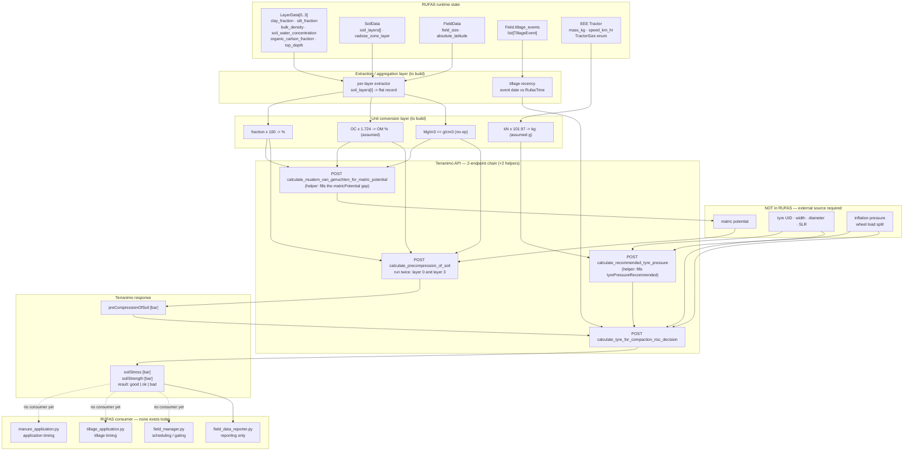

# RUFAS ↔ Terranimo — complete input/output mapping

**Repository:** `C:\Proyectos\RuFaS-MyForageSystem`
**Branch / commit:** `research/andrea-msf-prototype` @ `4fb378a`
**Terranimo spec:** OpenAPI 3.0.4, `services.terranimo.world/swagger/v1/swagger.json` (fetched 2026-08-18)
**Method:** AST parsing and targeted reads of RUFAS source. No RUFAS module imported, no RUFAS code
executed. No live Terranimo API calls.
**Closes:** Terranimo #2 (preliminary mapping), brought forward from Friday.

> **Headline: the prior mapping and this one are not the same exercise.**
> The earlier 12-exact/1-probable mapping matched the Terranimo API against the **theoretical model
> variables from the PDFs** (`W`, `D`, `SLR`, `prec`, `ptyre`, `FW`, …). This document matches the
> API against **RUFAS source code**. The two are very different: **6 of 13 are present in RUFAS,
> 1 needs a contested conversion, and 6 do not exist in the codebase at all.** Every tyre/machinery
> variable is missing. §5 lists them.

---

## 1. Input mapping

### 1.1 Soil-side inputs — endpoint 1, `POST /api/v1/calculations/calculate_precompression_of_soil`

| Terranimo API field | Terranimo unit | RUFAS location | RUFAS unit | Conversion needed | Confidence |
| --- | --- | --- | --- | --- | --- |
| `clayPercentage` | % | `LayerData.clay_fraction` — `field/soil/layer_data.py:280` (default `0.187`) | fraction, unitless | **× 100**. `GeneralConstants.FRACTION_TO_PERCENTAGE` exists and is already used this way at `soil_data.py:711` | **verified in code** |
| `siltPercentage` | % | `LayerData.silt_fraction` — `layer_data.py:282` (default `0.645`) | fraction, unitless | **× 100** | **verified in code** |
| `bulkDensity` | g/cm³ | `LayerData.bulk_density` — `layer_data.py:274` (default `1.4`) | **Mg/m³** (docstring `layer_data.py:49-51`) | **none numerically** — 1 Mg/m³ ≡ 1 g/cm³. Units differ in name only | **verified in code** |
| `waterContentPercentage` | % | `LayerData.soil_water_concentration` — `layer_data.py:258` (default `0.25`) | mm water / mm soil = **volumetric fraction** | **× 100** → volumetric %. See §5.3 — Terranimo does not state volumetric vs gravimetric | **assumed** |
| `organicMatterPercentage` | % | `LayerData.organic_carbon_fraction` — `layer_data.py:279` (default `0.012`) | organic **carbon** fraction, unitless | **× 100 × 1.724** (van Bemmelen OC→OM). RUFAS has **no organic-matter field and no such factor** — grep for `organic_matter` in `field/**` returns only a prose mention in `carbon_cycle.py:10` | **assumed** |
| `topSoil` | boolean | derivable — `LayerData.top_depth` / `bottom_depth` (`layer_data.py:252-253`); top layer is `SoilData.soil_layers[0]` | mm | `top_depth == 0` → `True` | **verified in code** (derivable) |
| `matricPotential` | bar | **NOT FOUND** — zero hits for `matric`, `suction`, `water_potential`, `tension` across `RUFAS/**/*.py` | — | see §5.1 — derivable via a **third** Terranimo endpoint | **not found** |

### 1.2 Machine-side inputs — endpoint 2, `POST /api/v1/calculations/calculate_tyre_for_compaction_risc_decision`

| Terranimo API field | Terranimo unit | RUFAS location | RUFAS unit | Conversion needed | Confidence |
| --- | --- | --- | --- | --- | --- |
| `tyreUID` | string | **NOT FOUND** — RUFAS models machines only as `TractorSize` enum `Small`/`Medium`/`Large` (`data_structures/tillage_implements.py:18-21`) | — | needs a size→UID lookup, or `/api/v1/tyres/search/{unitSystem}` | **not found** |
| `tyreLoad` | kg | **partial** — `Tractor.mass_kg` (`EEE/tractor.py`) is **whole-tractor mass**, looked up by size class from EEE constants (IDs 591/594/597) | kg | whole-tractor → per-wheel requires axle split and wheel count. Terranimo offers `calculate_axle_weights_for_attached_load` | **not found** (wheel-level) |
| `tyrePressure` | bar | **NOT FOUND** — no inflation pressure anywhere in RUFAS | — | must be supplied externally | **not found** |
| `tyrePressureRecommended` | bar | **NOT FOUND** in RUFAS — but obtainable from Terranimo `calculate_recommended_tyre_pressure`, which needs `workingSpeed` [km/h]; RUFAS **has** `Tractor.speed_km_hr` | km/h for the speed input | chain a third call | **not found** (derivable via API) |
| `recentTillage` | boolean | derivable — `Field.tillage_events: list[TillageEvent]` (`field/field/field.py:137`), `_check_tillage_schedule(time)` (`field.py:1045`). `TillageEvent` carries `tillage_depth` [mm], `incorporation_fraction`, `mixing_fraction` + date (`data_structures/events.py:170-182`) | date + mm | compare event date to current `RufasTime`; **"recent" threshold is undefined by Terranimo** | **assumed** (derivable; threshold unknown) |
| `preCompressionOfSoilTopLayer` | bar | **not RUFAS data** — output of endpoint 1 run against `soil_layers[0]` | bar | — | n/a (chained) |
| `preCompressionOfSoil` | bar | **not RUFAS data** — output of endpoint 1 run against the deep layer | bar | — | n/a (chained) |
| `matricPotential` | bar | as §1.1 | — | — | **not found** |

### 1.3 Tyre geometry — `W`, `D`, `SLR` are *not* API inputs

The prior mapping matched `W`/`D`/`SLR` to `TyreCompact.width` / `.diameter` / `.staticLoadedRadius`.
**`TyreCompact` is a Terranimo response object**, returned by `/api/v1/tyres/tyre/{tyreUid}/{unitSystem}` —
it is not accepted as input to any calculation. Terranimo takes a `tyreUID` and looks the geometry up
in its own database.

| Model variable | Model unit | RUFAS location | Role in the integration | Confidence |
| --- | --- | --- | --- | --- |
| `W` (tyre width) | m | **NOT FOUND** in RUFAS | select a tyre via `TyreSearchRequest` criterion `TyreWidth` | **not found** |
| `D` (tyre diameter) | m | **NOT FOUND** in RUFAS | select via criterion `TyreDiameterTolerance` | **not found** |
| `SLR` (static loaded radius) | m | **NOT FOUND** in RUFAS | **no search criterion exists** — returned by Terranimo, never supplied | **not found** |
| `FW` (wheel load) | kN | `Tractor.mass_kg` (whole tractor, kg) | → `tyreLoad`; ×101.97 kg per kN under standard gravity, plus axle split | **assumed** |

`ETyreSearchCriteria` values: `TyreDiameterTolerance`, `RimDiameterInches`, `TyreWidth`,
`TyreDimension`, `TyreName`, `TyreLoadIndex`.

### 1.4 Scorecard

| Status | Count | Fields |
| --- | ---: | --- |
| **verified in code** | 4 | `clayPercentage`, `siltPercentage`, `bulkDensity`, `topSoil` |
| **assumed** (conversion or threshold uncertain) | 3 | `waterContentPercentage`, `organicMatterPercentage`, `recentTillage` |
| **not found** in RUFAS | 6 | `matricPotential`, `tyreUID`, `tyreLoad` (wheel-level), `tyrePressure`, `tyrePressureRecommended`, tyre geometry (`W`/`D`/`SLR`) |

**Every soil input is available or derivable. No machine input is.**

### 1.5 Layer alignment — a favourable coincidence

Terranimo's compaction request names **"layer 1"** and **"layer 4"** without defining depths.
RUFAS's shipped soil config declares **3** layers (`input/data/soil/example_soil.json`), but
`SoilData._subdivide_top_layer` (`soil_data.py:367`) inserts a 20 mm top layer at construction — for
SurPhos reasons, per its docstring — giving **4 layers at runtime**:

| RUFAS runtime index | Depth | Terranimo analogue |
| ---: | --- | --- |
| 0 | 0–20 mm | "layer 1" (top layer) |
| 1 | 20–150 mm | — |
| 2 | 150–500 mm | — |
| 3 | 500–1000 mm | "layer 4"? |

Plus a separate `SoilData.vadose_zone_layer` (`soil_data.py:205`) outside the indexed list.

The count matches, but **whether the depths match is unverifiable** — Terranimo documents neither.
This is question 4 in the pending email to Stefan.

---

## 2. Data flow

Solid arrows are paths where the data exists; dashed arrows mark the return path that has **no
implemented consumer**. Note the chain is realistically **four** calls, not two: `matricPotential`
and `tyrePressureRecommended` each need their own helper endpoint because RUFAS holds neither.

---

## 3. Output mapping

| Terranimo output | Unit | Where it would be consumed | Decision it informs | Closest existing RUFAS home |
| --- | --- | --- | --- | --- |
| `result` (`good`/`ok`/`bad`) | enum | gate before a field operation executes | **whether to run a manure/tillage/harvest pass today** | `field/field/manure_application.py`, `tillage_application.py` |
| `soilStress` | bar | stored per field-day | diagnostic behind the verdict | `SoilData` (new field) or `FieldDataReporter` |
| `soilStrength` | bar | stored per field-day | diagnostic behind the verdict | as above |
| `preCompressionOfSoil` | bar | intermediate, feeds the risk call | — | transient; no storage needed |
| `recommendedPressure` + `currentPressureState` (`Low`/`Ok`/`High`) | bar / enum | machine setup advice | tyre inflation guidance to the operator | no home — advisory output, outside the simulation loop |
| `averageContactStress`, `maxContactStress`, `contactAreaWidth/Length` | bar / m | not needed for the verdict | detailed diagnostics | no home |
| `sci` | **undocumented** | — | unusable until Stefan defines it | none |

### 3.1 The realistic first consumer

`Field.manage_field` (`field/field/field.py:143`) runs the daily order: fertilizer → **manure
applications** → tillage → daily processes → crop management. A compaction gate would sit at the
start of the manure-application loop (`field.py:177-191`), before
`_execute_manure_application(...)`.

This matches the motivating use case in
`openspec/changes/integrate-slope-aspect-api/proposal.md`: *"the model can recommend applying manure
on a day that appears safe but that on a sloped field would generate significant runoff toward a
watercourse."* Compaction risk and slope-driven runoff risk are the same decision point.

### 3.2 Architectural precedent

`RUFAS/EEE/` is the working precedent for a cross-cutting consumer: it reads field-operation events
via `data_structures/tillage_implements.py`, touches **no** soil module, and is invoked once from
`simulation_engine.py:306`. A Terranimo layer could follow the same shape — but note EEE's enums
carry **no payload** (`docs/rufas_architecture_map.md` §7.4), so wheel load and tyre pressure are not
on that interface today.

---

## 4. Gaps

### 4.1 Terranimo inputs not available in RUFAS

| Gap | Severity | Options |
| --- | --- | --- |
| **Matric potential** — absent from RUFAS entirely | **medium** | Terranimo's own `calculate_mualem_van_genuchten_for_matric_potential` takes exactly the fields RUFAS has (waterContent, clay, silt, organicMatter, bulkDensity, topSoil). **Solvable inside the API chain.** But note the unit inconsistency flagged in the API analysis: matric potential appears as bar, hPa, cbar, and cBar across different Terranimo schemas |
| **All tyre identity and geometry** (`tyreUID`, `W`, `D`, `SLR`) | **high** | RUFAS models machines only as `Small`/`Medium`/`Large`. Needs either a curated size→tyre lookup table or an operator-supplied tyre per field operation |
| **Inflation pressure** (`tyrePressure`) | **high** | No RUFAS equivalent. Must come from farm data or a default-by-size assumption |
| **Wheel load** (`tyreLoad`) | **medium** | `Tractor.mass_kg` gives whole-tractor mass by size class. Needs axle distribution and wheel count — Terranimo's `calculate_axle_weights_for_attached_load` could help, but requires implement and hitch data RUFAS does not carry |
| **Organic matter** | **low** | Derivable from `organic_carbon_fraction` × 1.724, but that factor is absent from RUFAS and is itself contested in soil science (values 1.7–2.0 are used) |

### 4.2 Terranimo outputs with no clear consumer

- **Every one of them.** RUFAS has no compaction concept: no field, no module, no reporting
  variable. The `result` verdict has a plausible home (§3.1) but nothing consumes it today.
- `sci` is unusable — the spec gives no unit, range, or interpretation, and never expands the acronym.
- Contact-stress geometry and recommended-pressure outputs are **advisory to a human operator**, not
  inputs to a daily simulation step. They have no natural home in a batch simulation at all.

### 4.3 Assumptions made in this mapping

1. **OC → OM uses the van Bemmelen factor 1.724.** Not in RUFAS, not in the Terranimo spec. Needs
   SME sign-off.
2. **`waterContentPercentage` is volumetric.** RUFAS's `soil_water_concentration` is mm/mm
   (volumetric). Terranimo does not say which convention it expects; gravimetric would additionally
   require dividing by bulk density.
3. **Mg/m³ ≡ g/cm³ numerically.** Dimensionally correct, but assumes Terranimo means what the unit
   string says.
4. **`recentTillage` threshold.** Terranimo gives no definition of "recent". Assumed derivable from
   `Field.tillage_events` against a threshold we would have to choose.
5. **`tyreLoad` is a mass.** Documented "[kg]"; converting our kN wheel load assumes standard gravity
   (×101.97). Open question 3 in the Stefan email.
6. **Terranimo layer 1 / layer 4 map to RUFAS runtime layers 0 and 3.** The counts align after
   `_subdivide_top_layer`, but Terranimo documents no depths. Unverified.
7. **`topSoil` is boolean.** True in `SoilPrecompressionRequest`, but the same field is typed
   `number` in `MualemVanGenuchtenForMatricPotentialCalculationRequest` — the helper endpoint we
   would need for gap 4.1. Which is correct is open question 16.
8. **One call per field-day.** Terranimo has **no batch endpoint** (confirmed: zero occurrences of
   `batch`, no array request bodies). Compaction risk would be one HTTP call per wheel × layer ×
   timestep, and the spec documents no rate limit.

---

## 5. What this means for the decision

- **The soil half of the integration is ready.** Four fields verified, three derivable with stated
  assumptions, and the one true soil gap (matric potential) is solvable inside Terranimo's own API.
- **The machine half does not exist in RUFAS.** Tyre identity, geometry, and inflation pressure have
  no representation anywhere in the codebase. This is not a mapping problem — it is missing domain
  data, and it must come from farm records or operator input.
- **The prior "12 exact" figure describes the PDF model, not RUFAS.** Against the codebase the count
  is 4 verified / 3 assumed / 6 absent.
- **The chain is four calls, not two**, unless RUFAS gains a matric-potential computation and a tyre
  database of its own.

---

## Provenance

Produced at commit `4fb378a` by AST parsing and targeted reads of RUFAS source, cross-referenced
against `docs/terranimo_openapi.json` (in the `supabase-connector` repo) and
`docs/terranimo_api_analysis.md`. Line numbers, defaults, and units are verbatim from RUFAS source
and docstrings. No RUFAS module was imported, no RUFAS code executed, and no live Terranimo calls
were made. Negative findings ("not found") are name-based across `RUFAS/**/*.py`; dynamically
constructed names would not be visible to this method.
