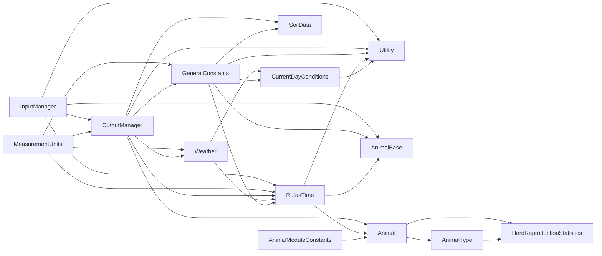

# Graph Report - RuFaS-MyForageSystem  (2026-04-30)

## Corpus Check
- 314 files · ~331,081 words
- Verdict: corpus is large enough that graph structure adds value.

## Summary
- 5730 nodes · 35085 edges · 56 communities detected
- Extraction: 19% EXTRACTED · 81% INFERRED · 0% AMBIGUOUS · INFERRED: 28580 edges (avg confidence: 0.51)
- Token cost: 0 input · 0 output

## Community Hubs (Navigation)
- [[_COMMUNITY_Community 0|Community 0]]
- [[_COMMUNITY_Community 1|Community 1]]
- [[_COMMUNITY_Community 2|Community 2]]
- [[_COMMUNITY_Community 3|Community 3]]
- [[_COMMUNITY_Community 4|Community 4]]
- [[_COMMUNITY_Community 5|Community 5]]
- [[_COMMUNITY_Community 6|Community 6]]
- [[_COMMUNITY_Community 7|Community 7]]
- [[_COMMUNITY_Community 8|Community 8]]
- [[_COMMUNITY_Community 9|Community 9]]
- [[_COMMUNITY_Community 10|Community 10]]
- [[_COMMUNITY_Community 11|Community 11]]
- [[_COMMUNITY_Community 12|Community 12]]
- [[_COMMUNITY_Community 13|Community 13]]
- [[_COMMUNITY_Community 15|Community 15]]
- [[_COMMUNITY_Community 16|Community 16]]
- [[_COMMUNITY_Community 17|Community 17]]
- [[_COMMUNITY_Community 18|Community 18]]
- [[_COMMUNITY_Community 19|Community 19]]
- [[_COMMUNITY_Community 20|Community 20]]
- [[_COMMUNITY_Community 21|Community 21]]
- [[_COMMUNITY_Community 22|Community 22]]
- [[_COMMUNITY_Community 23|Community 23]]
- [[_COMMUNITY_Community 24|Community 24]]
- [[_COMMUNITY_Community 25|Community 25]]
- [[_COMMUNITY_Community 27|Community 27]]
- [[_COMMUNITY_Community 29|Community 29]]
- [[_COMMUNITY_Community 30|Community 30]]
- [[_COMMUNITY_Community 31|Community 31]]
- [[_COMMUNITY_Community 32|Community 32]]
- [[_COMMUNITY_Community 33|Community 33]]
- [[_COMMUNITY_Community 35|Community 35]]
- [[_COMMUNITY_Community 36|Community 36]]
- [[_COMMUNITY_Community 37|Community 37]]
- [[_COMMUNITY_Community 38|Community 38]]
- [[_COMMUNITY_Community 39|Community 39]]
- [[_COMMUNITY_Community 41|Community 41]]
- [[_COMMUNITY_Community 42|Community 42]]
- [[_COMMUNITY_Community 43|Community 43]]
- [[_COMMUNITY_Community 44|Community 44]]
- [[_COMMUNITY_Community 45|Community 45]]
- [[_COMMUNITY_Community 46|Community 46]]
- [[_COMMUNITY_Community 48|Community 48]]
- [[_COMMUNITY_Community 53|Community 53]]
- [[_COMMUNITY_Community 74|Community 74]]
- [[_COMMUNITY_Community 75|Community 75]]
- [[_COMMUNITY_Community 76|Community 76]]
- [[_COMMUNITY_Community 82|Community 82]]
- [[_COMMUNITY_Community 83|Community 83]]
- [[_COMMUNITY_Community 84|Community 84]]
- [[_COMMUNITY_Community 85|Community 85]]
- [[_COMMUNITY_Community 86|Community 86]]
- [[_COMMUNITY_Community 87|Community 87]]
- [[_COMMUNITY_Community 103|Community 103]]
- [[_COMMUNITY_Community 104|Community 104]]
- [[_COMMUNITY_Community 105|Community 105]]

## God Nodes (most connected - your core abstractions)

<!-- MERMAID-START -->

<!-- MERMAID-END -->
1. `OutputManager` - 1455 edges
2. `GeneralConstants` - 1262 edges
3. `RufasTime` - 1072 edges
4. `MeasurementUnits` - 830 edges
5. `InputManager` - 605 edges
6. `AnimalModuleConstants` - 573 edges
7. `Utility` - 554 edges
8. `AnimalType` - 543 edges
9. `SoilData` - 401 edges
10. `Weather` - 399 edges

## Surprising Connections (you probably didn't know these)
- `Creates a dictionary of unit labels for each property in the ManureNutrients cla` --uses--> `MeasurementUnits`  [INFERRED]
  routines/manure/manure_nutrients/manure_nutrients.py → units.py
- `Calculate the dry matter fraction of the manure.          Returns         ------` --uses--> `MeasurementUnits`  [INFERRED]
  routines/manure/manure_nutrients/manure_nutrients.py → units.py
- `Calculate the nitrogen composition of the manure.          Returns         -----` --uses--> `MeasurementUnits`  [INFERRED]
  routines/manure/manure_nutrients/manure_nutrients.py → units.py
- `Calculate the phosphorus composition of the manure.          Returns         ---` --uses--> `MeasurementUnits`  [INFERRED]
  routines/manure/manure_nutrients/manure_nutrients.py → units.py
- `Contains information about the amounts of feeds held at the specified date.` --uses--> `MeasurementUnits`  [INFERRED]
  data_structures/feed_storage_to_animal_connection.py → units.py

## Communities

### Community 0 - "Community 0"
Cohesion: 0.01
Nodes (698): Calculate the temperature factor for each layer.          This function implemen, Calculate the moisture factor for carbon decomposition for the layer.          T, Calculate soil metabolic carbon decomposed to active carbon after accounting for, Calculate soil structural carbon being lost as carbon dioxide during decompositi, Calculate soil structural carbon decomposed to active carbon after accounting fo, Calculate soil structural carbon being lost as carbon dioxide during decompositi, Calculate soil structural carbon decomposed to slow carbon after accounting for, Aggregate the total amount of passive carbon in the layer.          This functio (+690 more)

### Community 1 - "Community 1"
Cohesion: 0.01
Nodes (673): _manufacture_crop_configuration(), Creates and validates the configuration for a single crop.          Parameters, Returns a list of the names of the available crop configurations.          Retur, Data structure used to store crop configuration attributes. Attribute descriptio, Returns the full crop configurations available in the simulation., Creates a CropData instance configured with the attributes of the specified crop, Manages and manufactures CropData instances using user-input crop configurations, Collects crop configuration inputs, validates them, and stores them so they can (+665 more)

### Community 2 - "Community 2"
Cohesion: 0.01
Nodes (458): AnimalGroupingScenario, Get the animal subtype of the given heiferIII.          Parameters         -----, Get the animal subtype of the given cow.          Parameters         ----------, The different scenarios for grouping animals on a farm.     Each scenario is a d, Get the animal type of the given animal.          Parameters         ----------, Find the animal combination that the given animal belongs to.          Parameter, Initialize the AnimalGroupingScenario.          Parameters         ----------, Get the animal subtype of the given calf.          Parameters         ---------- (+450 more)

### Community 3 - "Community 3"
Cohesion: 0.04
Nodes (460): Animal, AnimalConfig, initialize_animal_config(), AnimalConfig class that holds all the animal configuration parameters from user, Initialize the animal config from the input manager user input data., Adds a dictionary of sold animal information to the output manager.          Par, Adds a dictionary of sold animal information to the output manager on daily basi, Adds herd mean of latest_milk_production_305days to output manager,         thou (+452 more)

### Community 4 - "Community 4"
Cohesion: 0.01
Nodes (392): BaseManureTreatment, BaseBedding, BaseOrganicBedding, BeddingConfig, BeddingFactory, BeddingType, CBPBSawdustBedding, ManureSolidsBedding (+384 more)

### Community 5 - "Community 5"
Cohesion: 0.02
Nodes (277): The different scenarios for grouping animals on a farm.     Each scenario is a d, Get the animal subtype of the given heiferIII.          Parameters         -----, Get the animal subtype of the given cow.          Parameters         ----------, Get the animal type of the given animal.          Parameters         ----------, Find the animal combination that the given animal belongs to.          Parameter, Initialize the AnimalGroupingScenario.          Parameters         ----------, Get the animal subtype of the given calf.          Parameters         ----------, Get the animal subtype of the given heiferI.          Parameters         ------- (+269 more)

### Community 6 - "Community 6"
Cohesion: 0.01
Nodes (162): data_padder(), _record_animal_events(), _record_cows_conception_rate(), _record_heiferIIs_conception_rate(), report_305d_milk(), _report_average_nutrient_evaluation_results(), _report_average_nutrient_requirements(), report_daily_animal_population() (+154 more)

### Community 7 - "Community 7"
Cohesion: 0.02
Nodes (83): # TODO: Probably change the names of these scenarios to be more concise/descript, AnimalType, The different types/subtypes of animals on a farm.      Attributes     ---------, GeneralProperties, DiseaseOutcomes, Returns the value of the enum member as its string representation., A list of possible outcomes for animals that have developed a disease.      HEAL, create_crop_data() (+75 more)

### Community 8 - "Community 8"
Cohesion: 0.02
Nodes (91): CrossValidator, DataValidator, ElementsCounter, get_required_during_initialization(), Modifiability, Validates an data number element., Adds the counts of two ElementsCounter objects together.          Parameters, Validates a data string element. (+83 more)

### Community 9 - "Community 9"
Cohesion: 0.03
Nodes (84): _calculate_activity_energy_requirements(), _calculate_calcium_requirement(), _calculate_dry_matter_intake(), _calculate_growth_energy_requirements(), _calculate_maintenance_energy_requirements(), _calculate_phosphorus_requirement(), _calculate_pregnancy_energy_requirements(), _calculate_protein_requirement() (+76 more)

### Community 10 - "Community 10"
Cohesion: 0.04
Nodes (86): CarbonCycling, _determine_soil_active_carbon_fraction(), _determine_soil_mass(), _determine_soil_overall_carbon_fraction(), _determine_soil_passive_carbon_fraction(), _determine_soil_slow_carbon_fraction(), _determine_soil_volume(), _determine_total_carbon_CO2_lost() (+78 more)

### Community 11 - "Community 11"
Cohesion: 0.04
Nodes (38): ABC, AnimalHealth, AnimalHealthStatus, Calculator class representing the health status of the animal.     Will be the a, assess_disease_risk(), calculate_incidence_rate(), determine_at_risk_period(), Disease (+30 more)

### Community 12 - "Community 12"
Cohesion: 0.1
Nodes (22): _ammonia_resistance(), _anaerobic_effect(), _arrhenius_exponent(), calculate_housing_ammonia_emission(), calculate_liquid_storage_ammonia_emission(), calculate_liquid_storage_methane(), _carbon_decomposition_rate(), _convert_temperature_celsius_to_kelvin() (+14 more)

### Community 13 - "Community 13"
Cohesion: 0.07
Nodes (8): _add_phosphorus_to_pool(), calculate_phosphorus_sorption_parameter(), determine_soil_nutrient_area_density(), Initialize all attributes in the dataclass that depend on other attributes., Initializes the nitrogen pools in the soil layer.          Parameters         --, Initializes soil carbon pools based on the carbon content fraction of the layer., This method is a wrapper for adding a specified mass of phosphorus to the labile, This method is a wrapper for adding a specified mass of phosphorus to the active

### Community 15 - "Community 15"
Cohesion: 0.13
Nodes (16): determine_assimilated_phosphorus_amount(), _determine_dry_manure_matter_assimilation(), _determine_dry_matter_decomposition_rate(), determine_mineralized_surface_phosphorus(), _determine_moisture_change(), _determine_phosphorus_distribution_factor(), _determine_phosphorus_leached_from_surface(), _determine_rain_manure_dry_matter_ratio() (+8 more)

### Community 16 - "Community 16"
Cohesion: 0.18
Nodes (19): _determine_adjusted_sediment_yield(), _determine_carbon_content_factor(), _determine_clay_silt_ratio_factor(), _determine_coarse_fragment_factor(), _determine_coarse_sand_factor(), _determine_cover_management_factor(), _determine_exponential_term(), _determine_fraction_rainfall_during_time_of_concentration() (+11 more)

### Community 17 - "Community 17"
Cohesion: 0.15
Nodes (11): manure_calculations(), Calculates the manure excretion values for a calf with information from the rati, manure_calculations(), Calculates the manure excretion values for a non-lactating cow with information, # TODO: Further calculations to account for entire diet:- GitHub Issue #1218, calculate_phosphorus_excretion_values(), Calculates a set of phosphorus excretion values produced by a given animal., manure_calculations() (+3 more)

### Community 18 - "Community 18"
Cohesion: 0.23
Nodes (12): calculate_calf_manure(), calculate_cow_manure(), _calculate_dry_cow_manure(), calculate_heifer_manure(), _calculate_lactating_cow_manure(), _calculate_phosphorus_excretion_values(), # TODO: Same TODOs as in dry_cow_manure_excretion.py - GitHub Issue #1219, # TODO: Add TypedDicts for ration_formulation and available feeds - GitHub Issue (+4 more)

### Community 19 - "Community 19"
Cohesion: 0.29
Nodes (10): _determine_average_soil_temperature(), _determine_bare_soil_surface_temp(), _determine_cover_weighting_factor(), _determine_damping_depth(), _determine_depth_factor(), _determine_maximum_damping_depth(), _determine_radiation_factor(), _determine_scaling_factor() (+2 more)

### Community 20 - "Community 20"
Cohesion: 0.17
Nodes (1): pit_width()

### Community 21 - "Community 21"
Cohesion: 0.18
Nodes (6): AnimalEvents, Initialize a new AnimalEvents object., A class to represent animal events in a farm simulation.      This class tracks, Initialize event from a string          Args:                 events_str: string, Add a cow life event          Args:                 animal_age: the date counter, Return the most recent age at which the event_description happened          Para

### Community 22 - "Community 22"
Cohesion: 0.31
Nodes (9): _calculate_phosphorus_desorption(), _calculate_phosphorus_sorption(), _determine_desorption_base(), _determine_phosphorus_imbalance(), _determine_sorption_exponent(), _determine_sorption_scalar(), _determine_stable_to_active_phosphorus_mineralization(), This method handles the daily re-averaging of the phosphorus sorption parameter, (+1 more)

### Community 23 - "Community 23"
Cohesion: 0.22
Nodes (6): Generic method to generate application events.          Parameters         -----, Prepares the attributes to pass into the event classes constructor.          Par, repeat_pattern(), _validate_days(), _validate_parameters(), _validate_years()

### Community 24 - "Community 24"
Cohesion: 0.25
Nodes (10): feed_out_loss(), harvest_loss(), Description:         The only external function call. Runs the carbon loss sub-m, Description:         Carbon loss during harvest         "pseudocode_feed" F.1.3, Description:         Carbon loss during feed storage         "pseudocode_feed" F, Description:         Carbon loss during feed out         "pseudocode_feed" F.1.3, Description:         Update stored carbon based on calculated losses         "ps, storage_loss() (+2 more)

### Community 25 - "Community 25"
Cohesion: 0.27
Nodes (7): calculate_anaerobic_coefficient(), calculate_carbon_decomposition(), calculate_carbon_decomposition_rate(), calculate_ifsm_methane_emission(), calculate_max_microbial_decomposition_rate(), calculate_methane_conversion_factor(), calculate_slow_fraction_decomposition_rate()

### Community 27 - "Community 27"
Cohesion: 0.31
Nodes (8): CP_loss(), NPN_loss(), Description:         Crude protein loss to gas and leaching         "pseudocode_, Description:         The only external function call. Runs the nitrogen loss sub, Description:         Non-Protein-Nitrogen loss         "pseudocode_feed" F.1.3, Description:         Account for crude protein loss in relevant pools         "p, update_all(), update_CP()

### Community 29 - "Community 29"
Cohesion: 0.32
Nodes (3): _calc_fraction_of_day_from_minutes(), fraction_of_day_spent_in_holding_area(), fraction_of_day_spent_milking()

### Community 30 - "Community 30"
Cohesion: 0.38
Nodes (6): grouping(), norm(), percentile_list(), Normalizes a list of numerical values and returns the normalized list.      This, Calculates a list of percentiles corresponding to the matching value in the orig, Grouping algorithm that utilizes k-means clustering and takes an input     that

### Community 31 - "Community 31"
Cohesion: 0.47
Nodes (3): calculate_cow_methane(), _calculate_dry_cow_enteric_methane(), _calculate_lactating_cow_enteric_methane()

### Community 32 - "Community 32"
Cohesion: 0.5
Nodes (2): _get_ration(), optimize()

### Community 33 - "Community 33"
Cohesion: 0.5
Nodes (2): Initialize event from a string          Args:                 events_str: string, Add a cow life event          Args:                 animal_age: the date counter

### Community 35 - "Community 35"
Cohesion: 1.0
Nodes (2): calculate_solar_declination_radians(), determine_daylength()

### Community 36 - "Community 36"
Cohesion: 0.67
Nodes (2): ManureConstants, A class to store constants for manure management.

### Community 37 - "Community 37"
Cohesion: 0.67
Nodes (2): Units for quantities in manure manager output objects., Units

### Community 38 - "Community 38"
Cohesion: 1.0
Nodes (2): get_adjusted_schedule(), get_schedule()

### Community 39 - "Community 39"
Cohesion: 1.0
Nodes (2): degrade_protein(), update_all()

### Community 41 - "Community 41"
Cohesion: 1.0
Nodes (2): get_adjusted_schedule(), get_schedule()

### Community 42 - "Community 42"
Cohesion: 1.0
Nodes (1): Parses a unit string to handle units with exponents.          Parameters

### Community 43 - "Community 43"
Cohesion: 1.0
Nodes (1): Extracts the units from a key.          Parameters         ----------         ke

### Community 44 - "Community 44"
Cohesion: 1.0
Nodes (1): Combines two unit dictionaries by adding or subtracting their exponents.

### Community 45 - "Community 45"
Cohesion: 1.0
Nodes (1): Simplify the units by cancelling out common units in the numerator and denominat

### Community 46 - "Community 46"
Cohesion: 1.0
Nodes (1): Converts two dictionaries of units (numerator and denominator) back to a single

### Community 48 - "Community 48"
Cohesion: 1.0
Nodes (1): Provides a list of the string values of the enum members.          Returns

### Community 53 - "Community 53"
Cohesion: 1.0
Nodes (1): Calculate the amount of water in the soil profile when completely saturated (mm)

### Community 74 - "Community 74"
Cohesion: 1.0
Nodes (1): Abstract method to calculate the total amount of bedding needed for all animals.

### Community 75 - "Community 75"
Cohesion: 1.0
Nodes (1): Calculates how much organic bedding material was added to the total mass of manu

### Community 76 - "Community 76"
Cohesion: 1.0
Nodes (1): Create a bedding object of the specified type.          Parameters         -----

### Community 82 - "Community 82"
Cohesion: 1.0
Nodes (1): Calculate the reduction in methane yield.          This is a placeholder and sho

### Community 83 - "Community 83"
Cohesion: 1.0
Nodes (1): Calculate the reduction in methane yield for a given mitigation method.

### Community 84 - "Community 84"
Cohesion: 1.0
Nodes (1): Harcoded calf ration.          Returns         -------         Dict[str, float |

### Community 85 - "Community 85"
Cohesion: 1.0
Nodes (1): "         Returns "optimized" calf ration.          Notes         -----

### Community 86 - "Community 86"
Cohesion: 1.0
Nodes (1): Calculate dietary intake and nutrient requirements for the calf.          Parame

### Community 87 - "Community 87"
Cohesion: 1.0
Nodes (1): Calculating calf intake values.           Parameters         ----------

### Community 103 - "Community 103"
Cohesion: 1.0
Nodes (1): Calculates reduction in methane yield (%) due to addition of certain methane mit

### Community 104 - "Community 104"
Cohesion: 1.0
Nodes (1): True if the animal is a heifer, False otherwise

### Community 105 - "Community 105"
Cohesion: 1.0
Nodes (1): True if the animal is a cow, False otherwise

## Knowledge Gaps
- **340 isolated node(s):** `A list of acceptable units used within the RuFaS model.`, `Returns the value of the enum member as its string representation.`, `Parses a unit string to handle units with exponents.          Parameters`, `Extracts the units from a key.          Parameters         ----------         ke`, `Combines two unit dictionaries by adding or subtracting their exponents.` (+335 more)
  These have ≤1 connection - possible missing edges or undocumented components.
- **Thin community `Community 20`** (12 nodes): `freeboard_volume()`, `pit_depth()`, `pit_length()`, `pit_slope()`, `pit_surface_area()`, `pit_volume()`, `pit_width()`, `precipitation_volume()`, `total_pit_volume()`, `treatment_volume()`, `wastewater_volume()`, `slurry_storage_outdoor.py`
  Too small to be a meaningful cluster - may be noise or needs more connections extracted.
- **Thin community `Community 32`** (5 nodes): `calc_intake()`, `calc_requirements()`, `_get_ration()`, `optimize()`, `calf_ration.py`
  Too small to be a meaningful cluster - may be noise or needs more connections extracted.
- **Thin community `Community 33`** (4 nodes): `.add_event()`, `.init_from_string()`, `Initialize event from a string          Args:                 events_str: string`, `Add a cow life event          Args:                 animal_age: the date counter`
  Too small to be a meaningful cluster - may be noise or needs more connections extracted.
- **Thin community `Community 35`** (3 nodes): `current_day_conditions.py`, `calculate_solar_declination_radians()`, `determine_daylength()`
  Too small to be a meaningful cluster - may be noise or needs more connections extracted.
- **Thin community `Community 36`** (3 nodes): `ManureConstants`, `A class to store constants for manure management.`, `manure_constants.py`
  Too small to be a meaningful cluster - may be noise or needs more connections extracted.
- **Thin community `Community 37`** (3 nodes): `Units for quantities in manure manager output objects.`, `Units`, `units.py`
  Too small to be a meaningful cluster - may be noise or needs more connections extracted.
- **Thin community `Community 38`** (3 nodes): `get_adjusted_schedule()`, `get_schedule()`, `hormone_delivery_schedule.py`
  Too small to be a meaningful cluster - may be noise or needs more connections extracted.
- **Thin community `Community 39`** (3 nodes): `degrade_protein()`, `update_all()`, `protein_degradation.py`
  Too small to be a meaningful cluster - may be noise or needs more connections extracted.
- **Thin community `Community 41`** (3 nodes): `hormone_delivery_schedule.py`, `get_adjusted_schedule()`, `get_schedule()`
  Too small to be a meaningful cluster - may be noise or needs more connections extracted.
- **Thin community `Community 42`** (1 nodes): `Parses a unit string to handle units with exponents.          Parameters`
  Too small to be a meaningful cluster - may be noise or needs more connections extracted.
- **Thin community `Community 43`** (1 nodes): `Extracts the units from a key.          Parameters         ----------         ke`
  Too small to be a meaningful cluster - may be noise or needs more connections extracted.
- **Thin community `Community 44`** (1 nodes): `Combines two unit dictionaries by adding or subtracting their exponents.`
  Too small to be a meaningful cluster - may be noise or needs more connections extracted.
- **Thin community `Community 45`** (1 nodes): `Simplify the units by cancelling out common units in the numerator and denominat`
  Too small to be a meaningful cluster - may be noise or needs more connections extracted.
- **Thin community `Community 46`** (1 nodes): `Converts two dictionaries of units (numerator and denominator) back to a single`
  Too small to be a meaningful cluster - may be noise or needs more connections extracted.
- **Thin community `Community 48`** (1 nodes): `Provides a list of the string values of the enum members.          Returns`
  Too small to be a meaningful cluster - may be noise or needs more connections extracted.
- **Thin community `Community 53`** (1 nodes): `Calculate the amount of water in the soil profile when completely saturated (mm)`
  Too small to be a meaningful cluster - may be noise or needs more connections extracted.
- **Thin community `Community 74`** (1 nodes): `Abstract method to calculate the total amount of bedding needed for all animals.`
  Too small to be a meaningful cluster - may be noise or needs more connections extracted.
- **Thin community `Community 75`** (1 nodes): `Calculates how much organic bedding material was added to the total mass of manu`
  Too small to be a meaningful cluster - may be noise or needs more connections extracted.
- **Thin community `Community 76`** (1 nodes): `Create a bedding object of the specified type.          Parameters         -----`
  Too small to be a meaningful cluster - may be noise or needs more connections extracted.
- **Thin community `Community 82`** (1 nodes): `Calculate the reduction in methane yield.          This is a placeholder and sho`
  Too small to be a meaningful cluster - may be noise or needs more connections extracted.
- **Thin community `Community 83`** (1 nodes): `Calculate the reduction in methane yield for a given mitigation method.`
  Too small to be a meaningful cluster - may be noise or needs more connections extracted.
- **Thin community `Community 84`** (1 nodes): `Harcoded calf ration.          Returns         -------         Dict[str, float |`
  Too small to be a meaningful cluster - may be noise or needs more connections extracted.
- **Thin community `Community 85`** (1 nodes): `"         Returns "optimized" calf ration.          Notes         -----`
  Too small to be a meaningful cluster - may be noise or needs more connections extracted.
- **Thin community `Community 86`** (1 nodes): `Calculate dietary intake and nutrient requirements for the calf.          Parame`
  Too small to be a meaningful cluster - may be noise or needs more connections extracted.
- **Thin community `Community 87`** (1 nodes): `Calculating calf intake values.           Parameters         ----------`
  Too small to be a meaningful cluster - may be noise or needs more connections extracted.
- **Thin community `Community 103`** (1 nodes): `Calculates reduction in methane yield (%) due to addition of certain methane mit`
  Too small to be a meaningful cluster - may be noise or needs more connections extracted.
- **Thin community `Community 104`** (1 nodes): `True if the animal is a heifer, False otherwise`
  Too small to be a meaningful cluster - may be noise or needs more connections extracted.
- **Thin community `Community 105`** (1 nodes): `True if the animal is a cow, False otherwise`
  Too small to be a meaningful cluster - may be noise or needs more connections extracted.

## Suggested Questions
_Questions this graph is uniquely positioned to answer:_

- **Why does `OutputManager` connect `Community 5` to `Community 0`, `Community 1`, `Community 2`, `Community 3`, `Community 4`, `Community 6`, `Community 7`, `Community 8`, `Community 9`?**
  _High betweenness centrality (0.246) - this node is a cross-community bridge._
- **Why does `GeneralConstants` connect `Community 1` to `Community 0`, `Community 2`, `Community 3`, `Community 4`, `Community 5`, `Community 6`, `Community 7`, `Community 9`, `Community 10`, `Community 13`, `Community 15`, `Community 16`, `Community 17`, `Community 18`?**
  _High betweenness centrality (0.198) - this node is a cross-community bridge._
- **Why does `RufasTime` connect `Community 1` to `Community 0`, `Community 2`, `Community 3`, `Community 4`, `Community 5`, `Community 6`, `Community 7`, `Community 11`, `Community 26`?**
  _High betweenness centrality (0.146) - this node is a cross-community bridge._
- **Are the 1383 inferred relationships involving `OutputManager` (e.g. with `TaskType` and `TaskManager`) actually correct?**
  _`OutputManager` has 1383 INFERRED edges - model-reasoned connections that need verification._
- **Are the 1260 inferred relationships involving `GeneralConstants` (e.g. with `LogVerbosity` and `OriginLabel`) actually correct?**
  _`GeneralConstants` has 1260 INFERRED edges - model-reasoned connections that need verification._
- **Are the 1065 inferred relationships involving `RufasTime` (e.g. with `Weather` and `The `Weather` class manages all weather data used to run a single simulation.`) actually correct?**
  _`RufasTime` has 1065 INFERRED edges - model-reasoned connections that need verification._
- **Are the 826 inferred relationships involving `MeasurementUnits` (e.g. with `TaskType` and `TaskManager`) actually correct?**
  _`MeasurementUnits` has 826 INFERRED edges - model-reasoned connections that need verification._