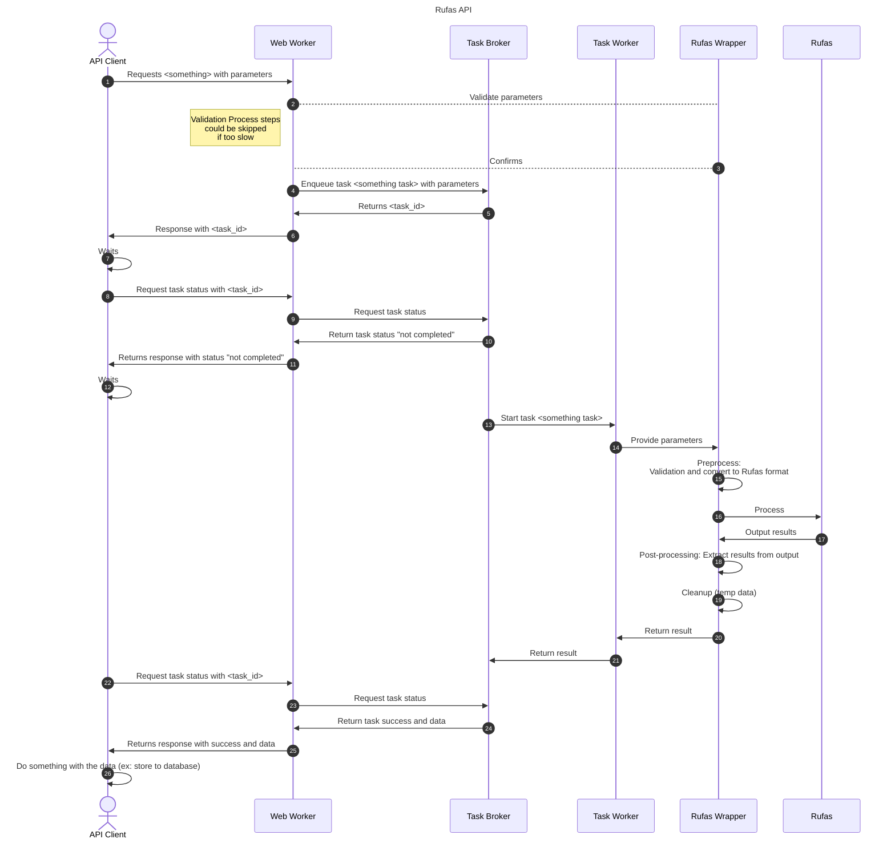
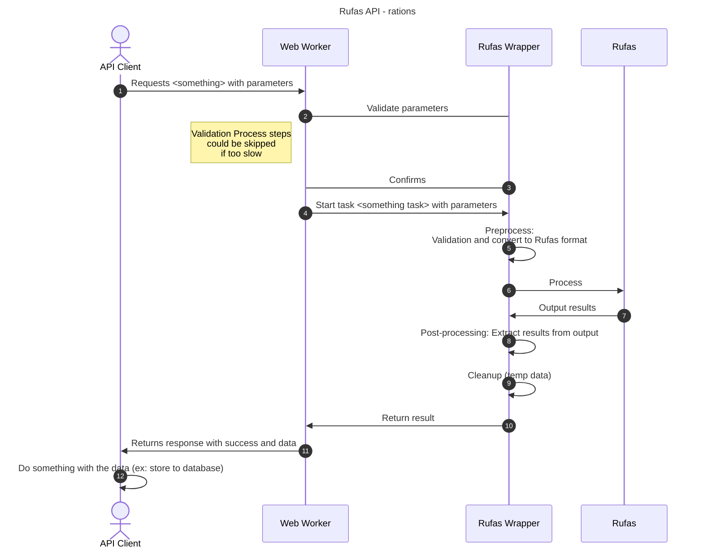

# Documentation for the API service for RuFaS

# Sequence diagrams
## Farm service:
This service is for launching the entire farm simulations using `RuFaS` class `TaskManager`. In such a case, the runtime
is relatively long (> 2 mins) and the service needs to be asynchronous.

## Only rations service:
This service is only for launching the calculations of animal rations. In such a case, the runtime is short and the
service is synchronous.

